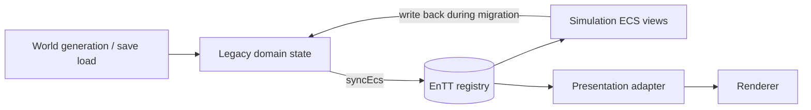

# EnTT ECS migration

The migration is intentionally staged. The legacy vectors remain the serialized
domain model while the EnTT registry becomes the stable runtime seam for systems
and, later, the renderer.

## Implemented

- EnTT `v3.15.0` is fetched by CMake and linked to simulation targets.
- `sim::ecs::Registry` and neutral components (`Identity`, `Transform`,
  `Renderable`, `Selectable`, `Person`) are defined without SDL or renderer
  handles.
- `World::syncEcs()` projects alive people, animals, buildings, resource nodes,
  and item stacks into the registry.
- Entity handles are stable across a tick. Entities that disappear are destroyed
  and new legacy slots receive new handles.
- The population report is the first migrated read-only query: it counts the ECS
  `Person` view after synchronization.
- Needs, work planning queries, ageing, and conception now consume separate ECS
  components through person views. `JobState` is the compact scheduling seam;
  the old aggregate vitals buffer has been removed.
- Save loading rebuilds the projection; renderer code is untouched.

## Next slices

1. Person vitals, ailment, temperature, job, inventory and social components
   are now split into independent packages; needs, demand, conception and
   livestock slices consume ECS views.
2. Keep serialization and legacy IDs at the boundary until all writers use ECS
   components. This preserves save compatibility and deterministic checksums.
3. The presentation adapter now consumes `Transform`/`SpriteRender`/
   `MeshRender` through `EcsWorld` and produces neutral batches. Renderer code
   remains unaware of ECS.
4. Remove vector fields and the remaining `syncEcs()` bridge only after job
   execution, construction, save/load and all interaction writers migrate.

## Parallelism boundary

Noise, height, biome classification, and per-tile decoration candidates depend
   on coordinates and immutable seeds, so they are GPU or worker-pool friendly.
   Object projection and sprite batching are also parallel by chunk after the
   registry snapshot is taken. Pathfinding, collision resolution, births/deaths,
   inventories, and construction reservations depend on neighboring or shared
   state; they need staged barriers or ownership partitioning. EnTT improves the
   data layout and query boundaries, but it does not make conflicting writes
   automatically parallel-safe.

> Migration meme: **first make the data boring and queryable; then make it fast.**

## Runtime pipeline boundaries

The repository has three deliberately separate runtime domains:

| Domain | Canonical location | Authority | Runs from `World::tick()` |
|---|---|---|---|
| World and terrain | `game/world`, `game/generation` | terrain/map/weather data | Yes, where applicable |
| Actor state | `game/ecs`, `game/simulation/needs.cpp`, `game/simulation/livestock.cpp` | EnTT components | Yes |
| Work | `game/work/planner.cpp`, `game/work/execution.cpp` | work pipeline reads world/ECS and commits assignments/results | No; its driver is independent |

Terrain, weather, foliage, and their render passes are intentionally outside
ECS. The work pipeline is also intentionally outside ECS: ECS is its typed data
source and commit target, not its scheduler or ownership model.

Marriage/population, construction, inventory, and farming are not active
simulation pipelines. Their old implementations are excluded from the tick and
will be replaced as independent systems later; they must not be reintroduced by
the ECS migration as compatibility behavior.
