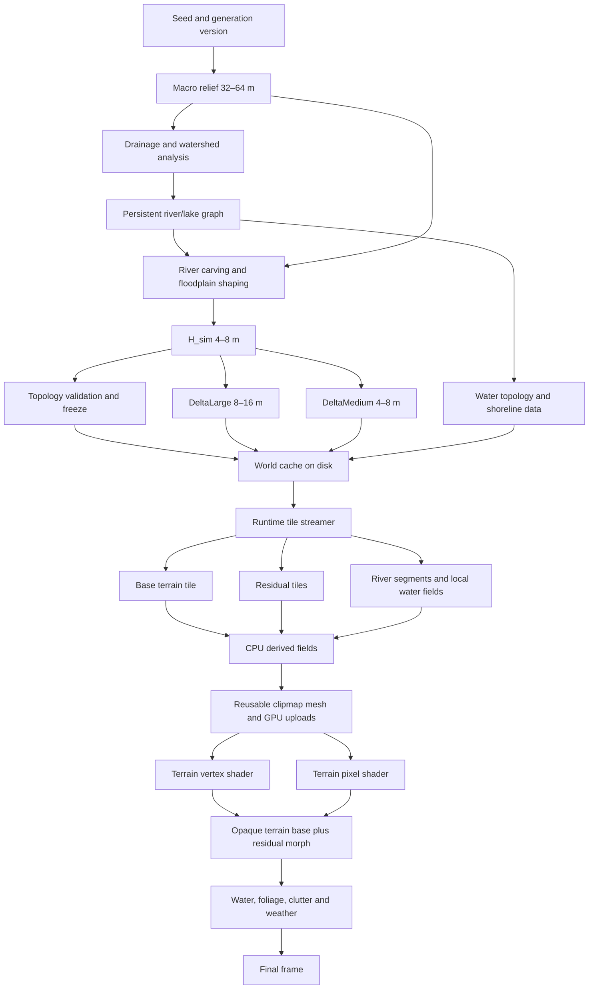

# RTS terrain generation, storage and streaming architecture

This document defines the target path from world generation to the terrain frame for a world of approximately 10,000 km². The storage budget for generated terrain data is 2–4 GB. The design keeps gameplay topology stable and uses visual refinement instead of regenerating a different terrain for every LOD.

## End-to-end graph 



## One-time world generation

The generator first creates a 32–64 m macro relief, then computes global drainage, watersheds, river branches, lakes and outlets. Rivers are represented as a persistent graph with stable IDs, confluences, discharge, width, depth and water-body references. The graph is generated once, saved in the world cache and reused by every terrain tile and every LOD.

The river graph is applied to the macro relief to produce `H_sim`. This is the gameplay heightfield. It contains the stable locations of major valleys, rivers, lakes, shorelines and cliffs. Visual LOD is not allowed to change these fields.

The generator then creates cumulative visual residuals:

```text
H_LOD3 = H_sim
H_LOD2 = H_sim + DeltaLarge
H_LOD1 = H_sim + DeltaLarge + DeltaMedium
H_LOD0 = H_sim + DeltaLarge + DeltaMedium + DeltaFine
```

`DeltaFine` is deterministic and generated only near the camera. It is not stored for the entire world.

## Disk budget for 10,000 km²

The following is a target budget after quantization and compression, not a promise about a particular compressor:

| Data | Resolution | Target size |
|---|---:|---:|
| `H_sim` | 4–8 m | 0.5–1.0 GB |
| Macro topology and masks | 16–64 m | 0.1–0.3 GB |
| River/lake graph and indices | vector | 0.1–0.3 GB |
| `DeltaLarge` | 8–16 m | 0.2–0.5 GB |
| `DeltaMedium` | 4–8 m | 0.3–0.8 GB |
| Tile index, versions, metadata | — | 0.1–0.3 GB |
| **Total** | — | **about 1.3–3.2 GB** |

Normals, slope, curvature, material weights, wetness, foam and foliage density are derived from the base and residuals. They are not stored as full-resolution global rasters.

## Runtime memory and work

Always resident in RAM:

```text
seed and generation version
macro terrain and coarse topology
river/lake graph and spatial index
active H_sim LRU cache
tile metadata
```

Typical budget: 0.5–2 GB, depending on whether the complete 4 m `H_sim` layer is decoded in RAM.

Loaded around the camera:

```text
H_sim tiles
DeltaLarge and DeltaMedium tiles
nearby river segments plus halo
local shoreline, depth and water masks
persistent local modifications
```

The streamer loads tiles asynchronously by screen-space priority. A tile is never regenerated because the camera crossed an epoch or changed zoom; it is looked up by world coordinate, LOD and generation version.

CPU workers process different tiles independently. They derive normals, slope, curvature, materials, local water fields, foliage instances and upload data. They read immutable world fields and write private tile outputs, so no worker modifies a shared heightfield.

The GPU keeps only the visible clipmap/ring area. A 20×20 km window at 4 m contains about 25 million samples; a packed height channel is about 50 MB. Including residuals, masks and buffers, a 150–500 MB GPU terrain budget is realistic.

## RTS LOD policy

### Geometry is not a streamed mesh

Terrain keeps one immutable 64x64-cell grid topology. A draw instance supplies
its world origin, geometric step, data-page addresses, edge transition mask and
morph factor. Changing LOD changes the active quadtree cut; it never rebuilds or
uploads a vertex/index mesh.

Stored data and raster topology deliberately have different levels:

| geometry step | sampled data |
|---:|---:|
| 4 m, 8 m | H4 runtime pages |
| 16 m, 32 m | persistent H16 |
| 64 m, 128 m, 256 m | persistent H64 |

H8 and H32 are not datasets. H128/H256 are filtered raster representations of
H64 used when a 64 m triangle would be sub-pixel. H64 is derived from the final
H16 field, and their shared samples are identical. Likewise every finer field is
a parent surface plus a residual whose value is zero at shared parent vertices.

A split first makes all four children resident, atomically replaces the parent
draw with children collapsed onto the parent surface, then morphs them towards
the fine field. A merge reverses the morph, replaces the collapsed children with
their parent, and only then releases fine-page pins. Missing detail therefore
leaves the parent visible and never stalls a frame.

Persistent H64/H16 pages are sparse over a conservative 64 m land mask. A mask
cell is land if any generated land overlaps it; coast is land and storage keeps
a halo for filtering and normals. H4 is budgeted runtime residency. Detail below
4 m is shader-only.

LOD selection combines projected triangle size and projected parent deviation,
with separate refine/coarsen thresholds. Selection and residency include a halo
beyond the visible footprint; only visible nodes enter the draw list.

RTS camera behavior is different from an RPG camera. The default policy should prefer one dominant LOD for the complete visible gameplay area. Mixing many LODs across the screen is undesirable in top-down view because it is visible as a change of texture frequency and silhouette quality.

LOD selection must use projected screen error, not only radial world distance:

```text
projected_error = terrain_error / projected_distance
```

The camera footprint is computed from its frustum and ground intersection. The same LOD is selected for most of that footprint. A narrow outer band may use one coarser level as a preloaded fallback, but it must be visually subordinate and must share the same `H_sim`.

### Top-down camera

For a near top-down view:

```text
inner gameplay footprint: one dominant LOD
outer preload band: one coarser LOD
far backdrop: macro H_sim only
```

The outer band exists for streaming latency, not as a visible checkerboard of detail levels. The base remains opaque and the residual is morphed in; there is no radial alpha reveal.

### Oblique camera

When the camera tilts, screen distance becomes more important than ground distance. The near part of the frustum still uses one dominant gameplay LOD, while distant terrain can step down through 2–3 LOD bands because the projected error is smaller.

The bands should follow frustum depth or projected error, not circles around the camera. This is the RPG-like case where different LODs on one screen are acceptable because they correspond to genuinely different screen sizes.

## Rings versus square tiles

Rings are useful as a **priority and visibility policy**, but they are not ideal as the physical storage layout. The world data should be stored in square, world-aligned tiles or clipmap pages because this gives predictable cache locality, compression blocks and GPU texture addressing.

The recommended hybrid is:

```text
square tiles on disk and in cache
        ↓
frustum/projected-error selector
        ↓
ring-like priority order when top-down
        ↓
shared clipmap mesh and residual textures
```

This preserves the useful “load from the centre outward” behavior without reading a matrix in a poor circular pattern. The scheduler may request tiles in rings, but adjacent square pages remain resident and are uploaded in contiguous batches.

The mesh topology should be reusable. Camera movement changes page contents and texture residency; it does not rebuild an independent polar annulus with a new epoch. If a ring presentation is retained, it should be a mask over the square clipmap pages, with shared world-space boundary vertices and explicit transition indices.

## Water path

Water topology is generated once with the river graph:

```text
waterBodyId
water level
river centerline
river width/depth
shoreline polygon
signed distance to shore
inlets and outlets
```

At runtime, a tile queries only nearby graph segments and builds local `waterDepth`, `shorelineDistance` and wetness fields. The water surface is not independently inferred from a new set of terrain triangles for each LOD.

At distance, a river is a coarse mask or centerline. Near the camera, the same river receives a more accurate corridor, shoreline and surface detail. Its ID, route, confluences and water level remain unchanged.

## GPU composition

The vertex shader should sample or receive:

```hlsl
height = H_sim
       + persistentDeformation
       + DeltaLarge * factorLarge
       + DeltaMedium * factorMedium
       + DeltaFine * factorFine;
```

The factors are regional or band-level values shared by geometry, normals, material detail, water shore detail and foliage. The base terrain is always opaque. Streaming changes residual factors and resource residency; it does not clip away the whole terrain patch.

Fine cracks, micro-normal, small ripples, foam variation, grass density and other sub-meter effects remain procedural in shaders. They do not consume global disk storage.

## Required implementation order

1. Define and serialize immutable `H_sim` and hydrology/topology data.
2. Generate and cache `DeltaLarge` and `DeltaMedium` independently.
3. Add a spatial index for river segments and water bodies.
4. Replace full-ring regeneration with square tile/clipmap page streaming.
5. Make mesh topology reusable and add shared LOD transition indices.
6. Move terrain refinement to residual sampling and a shared detail factor.
7. Replace terrain-wide radial `clip()` and the loading vignette with opaque base coverage.
8. Make water use stable water-body fields and a separate continuous surface representation.
9. Use one GPU terrain path as production; keep the SDL path only as a debug fallback.
10. Validate camera sweeps, zoom changes and oblique views against topology, seam and frame-time tests.

The result is a stable RTS world: one dominant visible LOD for the gameplay footprint, coarser data only where projected error allows it, and progressive refinement of the same terrain and water instead of regeneration or redraw of a different surface.
