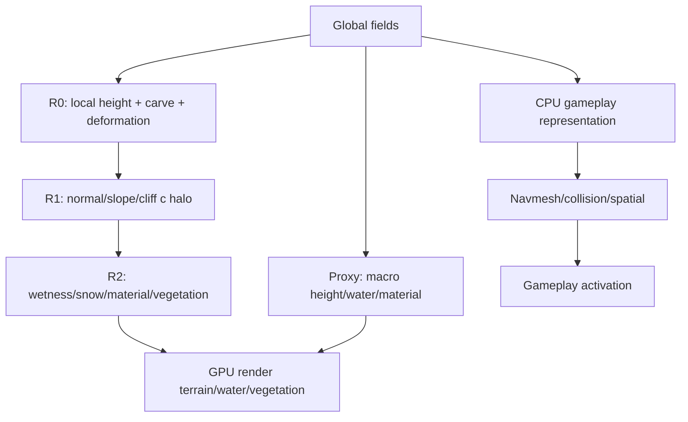

# Зависимости генерации и отрисовки terrain streaming

Документ разделяет runtime terrain по зависимостям: что можно считать независимо
для каждого world-space sample, что требует только локального halo, а где нужны
глобальные данные или завершение другого процесса.

## Основной принцип

```text
CPU: глобальная география, topology, semantics, gameplay
GPU: плотные визуальные поля, локальная детализация, отрисовка
```

Чанк — адрес хранения и планирования, а не граница процедурной функции. Высоты,
материалы и кандидаты растительности вычисляются из `seed + worldX/worldY` и
общих global fields. Поэтому соседние чанки согласуются автоматически.

## Полностью независимые операции

Результат имеет вид `f(seed, worldX, worldY, global fields)`. Соседний чанк не
нужен; операция подходит для GPU compute или независимых CPU workers:

- fBm, domain warp и другой процедурный шум;
- чтение macro height, coarse biome и climate;
- локальные hills/detail noise;
- применение известных river segments, water levels и deformation commands;
- world-space variations цвета и текстур;
- ветер, волны и атмосферная анимация;
- детерминированные кандидаты растительности.

Для proxy лучше использовать macro height + coarse water/material, а не отдельный
шум, который позднее может изменить глобальная география.

## Операции с локальными соседями

Нормали и фильтры читают samples за пределами текущего чанка. Соседний чанк ждать
не нужно: считаем небольшой halo/ghost margin той же функцией.

- normal и slope;
- curvature и локальная классификация cliff;
- сглаживание material masks;
- локальная shore/wetness оценка;
- маленькие blur/filter kernels.

GPU-порядок:

```text
R0: height + halo
  -> GPU barrier
R1: normal/slope/cliff
  -> GPU barrier
R2: wetness/snow/material/vegetation suitability
  -> render
```

Barrier нужен между GPU dispatch, когда следующий kernel читает результат
предыдущего. CPU при этом продолжает работу. Если дешевле, R1 может повторно
вычислять height в соседних точках вместо чтения height texture.

## Локальные этапы, зависящие от предыдущих полей

Здесь нет зависимости от соседнего чанка как от объекта, но есть зависимость от
готового предыдущего поля:

```text
height -> normal/slope -> materials/wetness/snow -> vegetation instances
```

Материалы, снег, влажность, cliff appearance и suitability растительности можно
считать на GPU и раскрывать независимо. Terrain может быть виден, пока material
control уточняется, а CPU строит navmesh.

Дальняя и ближняя растительность должны использовать один deterministic source:
одни seed, world coordinates и candidate positions. Иначе лес изменится при LOD.

## Дальние зависимости

Следующие процессы нельзя корректно считать изолированно одним чанком:

- flow accumulation и river discharge;
- basin/lake spill points;
- перенос влаги и orographic precipitation;
- hydraulic erosion и sediment transport;
- динамическое затопление и связанное течение;
- глобальная topology и graph connectivity.

Их надо выполнить заранее на уровне мира, крупными областями или итеративными GPU
passes с обменом границами. После сериализации в global fields/river graph runtime
materialization снова становится в основном локальной.

## CPU-authoritative слой

CPU оставляет за собой seed, macro geography, river graph, lake levels,
authoritative deformation, walkability, collision, navmesh, buildings, blockers,
resources, simulation, cross-chunk portals и gameplay activation. GPU может строить
подробный визуальный terrain, но он не должен быть единственной истиной для
gameplay.

## Предлагаемый runtime flow



## Кольца вокруг камеры

Кольца задают желаемое качество, а не обязательную готовность:

| Область | Геометрия | Материалы | Растительность | Gameplay |
|---|---|---|---|---|
| Центр | fine | fine | actual/near | active |
| Inner ring | medium/fine | detailed | dithered | preparing |
| Middle ring | proxy/medium | macro + partial | GPU distant | inactive |
| Teleport fallback | proxy | macro | optional distant | inactive |

При движении кольца сдвигаются. Предзагрузка учитывает predicted camera position
и скорость: направление движения повышает priority перед близким чанком позади.

Состояния хранятся раздельно:

```text
proxyReady
terrainReady / terrainMorph
materialReady / materialReveal
vegetationReady / vegetationReveal
gameplayReady
```

`terrainReady` не должен ждать `gameplayReady`.

## Что уже есть и что реализовывать

В проекте уже есть CPU `HeightField`, асинхронный `PatchWorkshop`, LOD morph,
world-space материалы, GPU MaterialControl и NavMesh. Минимальная последовательность:

Текущий прогресс в рабочем дереве:

| Пункт | Состояние |
|---|---|
| Coarse proxy и fallback после teleport | реализовано через синхронный `warmUp` для coarse LOD |
| Раздельные visual/gameplay states | реализовано в `TerrainPatch` и `Explorer::StreamRecord` |
| Reveal от фактической GPU-загрузки | реализовано в `TerrainCollector::gpuTransition` |
| Predicted camera и направленная preload-зона | реализовано; look-ahead 0.75 s, 1–2 кольца вокруг прогноза |
| GPU R0/R1/R2 | реализовано для camera-aligned control view, с height atlas layers |
| World-space irregular reveal | реализовано для terrain и foliage shader paths |
| Atmospheric masking | добавлена distance-based haze для terrain и water |
| Dressing/gameplay activation | `markGameplayRequested`, `takeGameplayRequests` и `markGameplayReady` образуют независимый scheduler hand-off |
| VRAM budget/pool для height fields и vegetation | height fields: bounded 64-layer atlas с LRU и regression tests; vegetation: переиспользуемый 8 MiB instance-buffer pool в `MeshCache`; runtime byte stats есть для обоих путей |
| Artificial delays/freeze | runtime hooks и overlay со state counters добавлены; автоматические regression tests ещё требуется подключить |
| Camera teleport fallback | добавлен jump detector: prediction/velocity сбрасываются, coarse warm-up остаётся источником первого кадра |
| Transition tuning | `TerrainCollectPass::setRevealDurations` делает terrain/vegetation timing configurable (0.01–10 s, vegetation delay до 95%) |

1. Гарантировать coarse proxy для всей видимой области и после teleport.
2. Ввести явные visual/gameplay states на чанк.
3. Запускать reveal после фактической GPU-доступности ресурса, а не после CPU cache.
4. Добавить predicted-camera priority и speed-dependent preload radius.
5. Перенести локальный R0/R1/R2 на GPU, оставив CPU gameplay representation.
6. Добавить irregular world-space reveal для terrain/material/vegetation.
7. Подключить dressing и независимую gameplay activation.
8. Добавить VRAM budget и pool для GPU field/instance resources.
9. Добавить artificial delays, freeze, teleport и high-speed popping tests.

## Оценка usage для реализации

Оценка относится к работе агента в этом репозитории, а не к runtime GPU стоимости.
Она зависит от SDL_GPU backend и количества shader/resource bugs.

| Этап | Содержание | Usage агента |
|---|---|---:|
| A | Контракты состояний и тестовый план | 5–10k tokens |
| B | Proxy coverage, teleport fallback, readiness | 10–20k |
| C | Predicted streaming, priorities, rings | 8–16k |
| D | GPU R0/R1/R2 и barriers | 20–40k |
| E | Irregular reveal и transitions | 12–25k |
| F | GPU topology, pools, memory budget | 15–30k |
| G | Gameplay readiness и activation | 12–25k |
| H | Debug delays, benchmarks, fixes | 15–30k |

Полная аккуратная реализация: примерно **100–190k токенов**, обычно 8–15
содержательных итераций. Практический MVP (proxy, states, predicted priority,
timing reveal и debug tests): **35–65k токенов**.

Полный GPU перенос геометрии не обязателен первым этапом. Если bottleneck — CPU
mesh generation/upload, reusable grid topology и GPU height sampling дадут выигрыш.
Если bottleneck в другом, разумнее оставить CPU topology и отдать GPU плотные поля.

## Ожидаемый результат

После MVP новая область сначала показывает proxy, затем плавно получает geometry
morph, material reveal и vegetation dither; gameplay догружается независимо.
Полный GPU pipeline уменьшит CPU работу, но сам по себе не решит глобальную
гидрологию, LOD seams, границы материалов и gameplay consistency.

## Verification record

Проверенный текущий рабочий контур:

- `ninja -C build` — успешно;
- `build/shader_lint` — 14/14 шейдеров;
- terrain/material/navigation regression tests — 5/5;
- height atlas regression tests — 2/2;
- `git diff --check` по затронутым файлам — без ошибок.

Полный `asr_tests` доходит до content-проверки и сообщает об отсутствующих
файлах `assets/sprites/raw_srcs/kenney_foliageSprites/PNG/Shaded/sprite_0052.png`
и следующих. Эти файлы находятся вне terrain streaming изменений.
