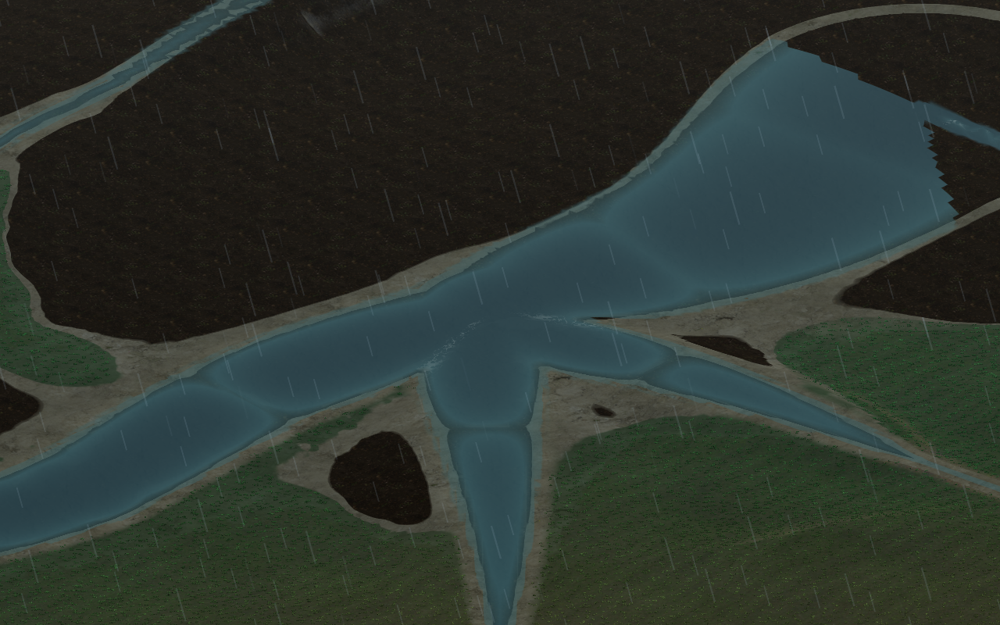
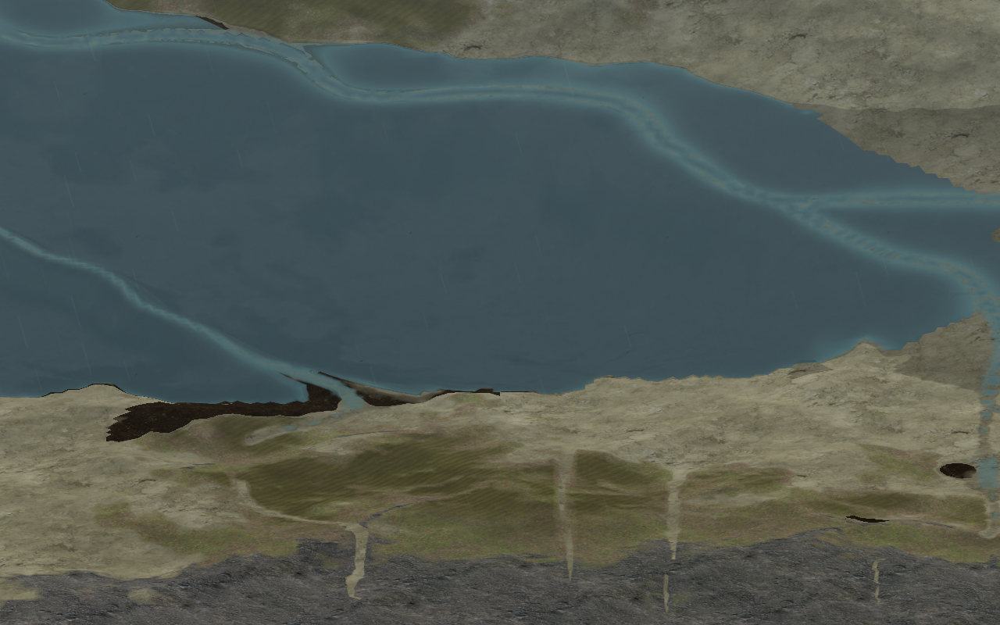
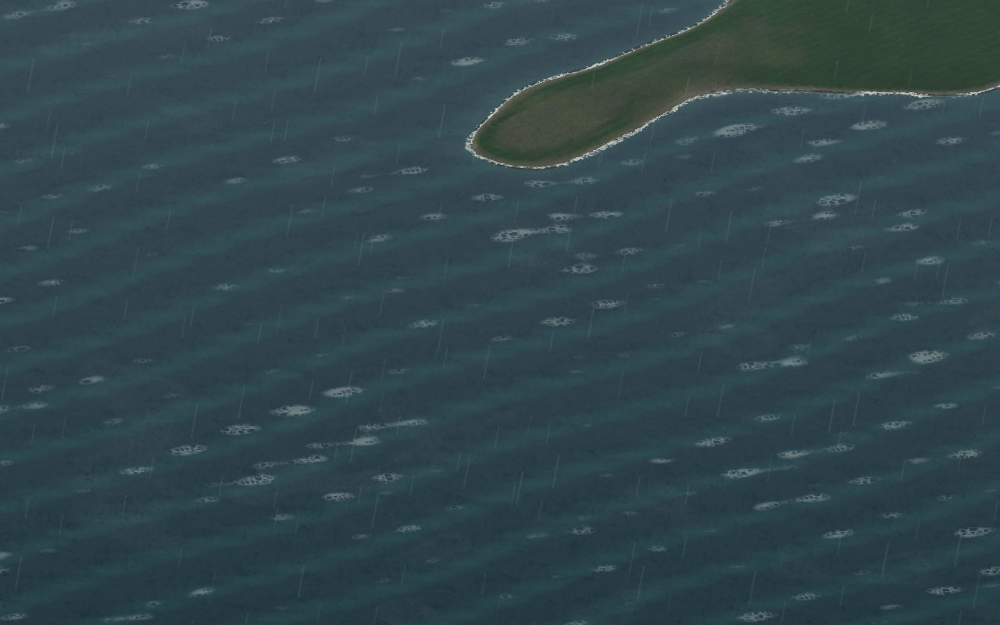
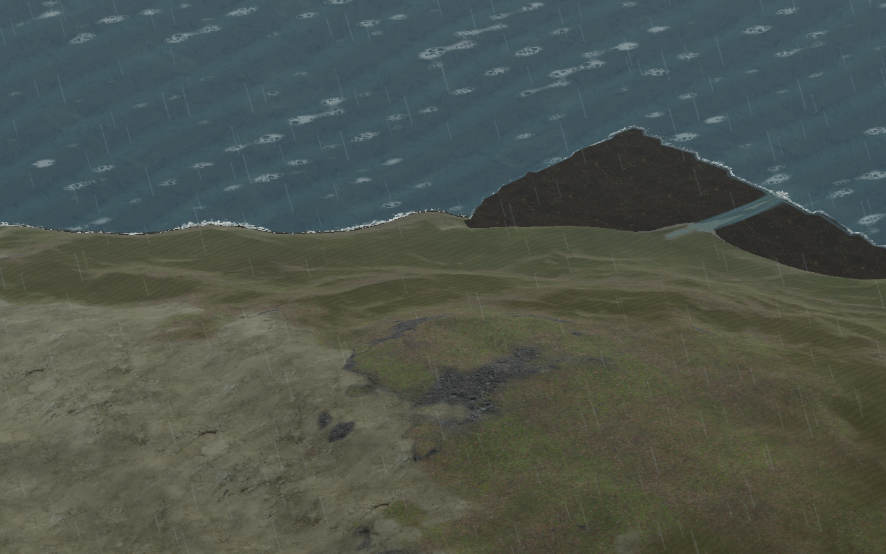
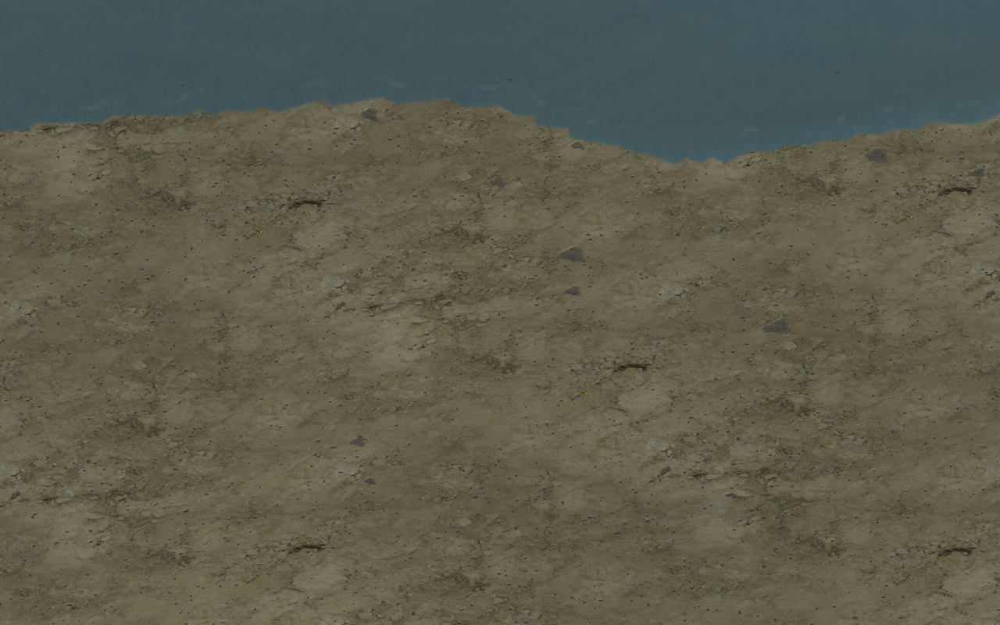
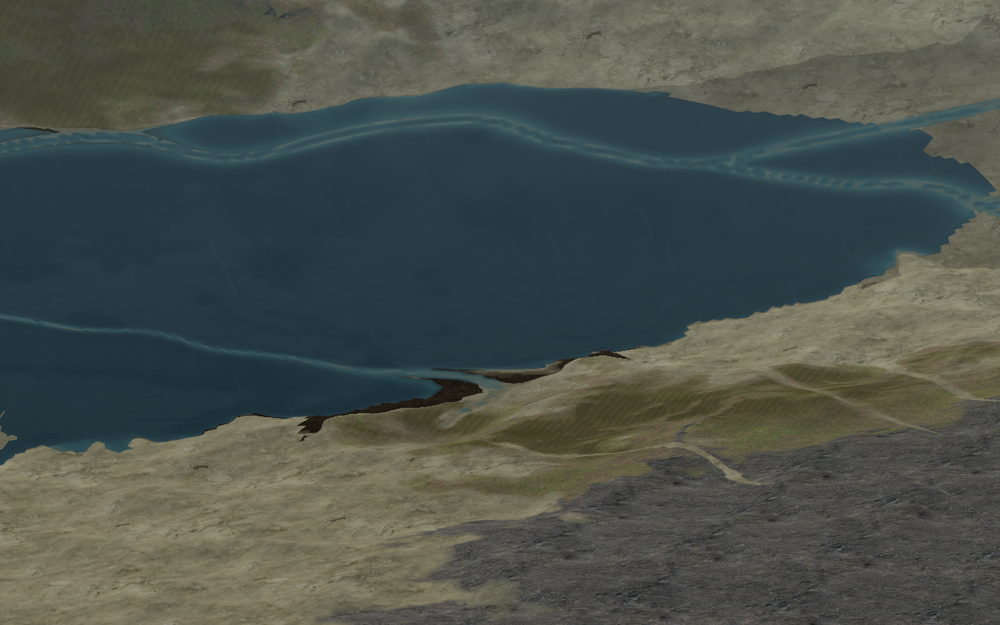
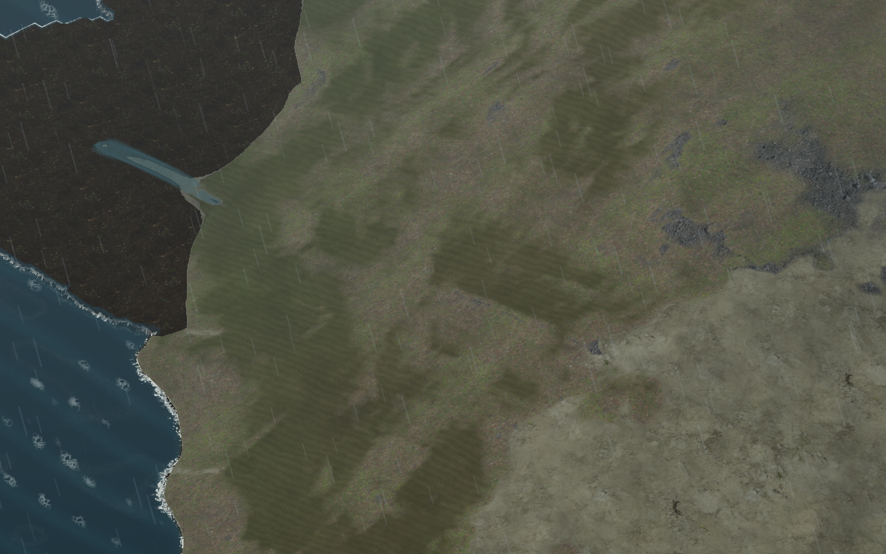

# Визуальный обзор `--explore`

Дата обзора: 2026-09-10. Все кадры сняты одним бинарником
`build-gpu/asr_client`, на мире `256`, seed `11`, с ожиданием полной загрузки
видимых колец. Команды использовали стандартный ракурс explorer; параметры
указаны рядом с кадром. Кадры фиксируют наблюдаемые проявления, а не доказывают
причину дефекта.

## Найденные проблемы

### P1 — вода образует геометрические «пузыри» на развилках

На пересечении русел в центре кадра вода собирается в несколько гладких
каплевидных расширений и образует почти крестовую фигуру. Береговые линии
сходятся с резкими углами, а узкие протоки выглядят как наложенные друг на
друга ленты. Это похоже на ошибку объединения/растеризации соседних водных
полигонов или на неверную интерполяцию покрытия на стыке патчей.

Кадр: `river2_01.png`, `--at river --zoom 2`.

### P2 — ступенчатый берег и полосы воды на крупном озере

У верхнего и правого берега заметна выраженная ступенька по границе воды.
Внутри озера проходят тонкие полупрозрачные полосы, похожие на отдельные
русловые ленты, хотя берег вокруг них непрерывен. На нижнем берегу видны
тёмные островки и резкие разрывы покрытия.

Кадр: `lake_01.png`, `--at lake --zoom 0.5`.

### P3 — чрезмерно яркие повторяющиеся белые всплески на поверхности воды

На открытой воде почти равномерно разбросаны сотни ярких белых колец/штрихов.
Они заметнее самой ряби и создают шумовой рисунок, особенно на море. В дождь
эффект усиливается, но отдельные белые пятна присутствуют и в обычном кадре.
Нужно проверить интенсивность/частоту ripple-слоя и его затухание по расстоянию.

Кадр: `coast_01.png`, `--at coast --zoom 0.7`.

### P4 — полигональные тёмные клинья на берегу и в горном рельефе

Вдоль берега видны крупные почти чёрные клиновидные области с очень резкой
границей относительно соседней зелёной/каменистой поверхности. Форма выглядит
как несколько крупных треугольников материала или пропущенная маска покрытия,
а не как естественная смена биома. Стоит сравнить material weights соседних
вершин и переходы LOD.

Кадр: `mountains_01.png`, `--at mountains --zoom 0.6`.

### P5 — пустынная поверхность теряет макрорельеф и выглядит плоской

На масштабе `zoom 8` почти весь кадр занимает однотонная плоскость с мелким
шумом текстуры. Макрорельеф и различимые песчаные формы отсутствуют, при этом
граница с водой сверху остаётся заметно ступенчатой. Это может быть как
недостаток амплитуды desert-height/detail, так и слишком агрессивный LOD.

Кадр: `desert_01.png`, `--at desert --zoom 8`.

### P6 — озеро выглядит как поднятая плита над рельефом

С бокового ракурса край большого озера не повторяет ближайший рельеф: водная
поверхность читается как единая поднятая плоскость, а у берега остаются тонкие
врезанные протоки и тёмные прослойки земли. На нижней кромке особенно заметно,
что вода не выглядит помещённой в чашу — она визуально висит над склоном.
Это отдельная проблема от ступенчатой береговой маски: здесь подозрение падает
на высоту воды/основание и порядок depth test.

Кадр: `lake_float_side.png`, координаты `25785,66623`, `--zoom 0.5 --pitch 28`.

### P7 — огромные чёрные пятна распадаются по крупным полигонам

На дальнем горном ракурсе видны большие почти чёрные области с прямыми и
ломаными границами. Они занимают целые крупные куски поверхности, резко
обрываются у соседнего материала и местами образуют отдельные «острова».
Размер и форма больше похожи на пропущенный material/biome weight либо пустой
LOD-буфер, чем на осмысленную текстуру породы. При приближении пятно меняется,
что дополнительно указывает на стык уровней детализации.

Кадр: `blackpatch_far.png`, координаты `26730,60750`, `--zoom 0.6 --pitch 45`.

## Дополнительные контрольные кадры

`river_01.png`, `river_highzoom_01.png`, `coast_lowzoom_01.png` и
`lake_storm_01.png` оставлены как контрольные проявления тех же классов
дефектов (вода/LOD/погода), но отдельными проблемами не считаются.

## Что проверять первым

1. Стыки водных полигонов, высоту воды и расчёт `waterCover` (P1–P2, P6).
2. Маску/интенсивность surface ripple и её зависимость от погоды (P3).
3. Material weights и морфинг между уровнями колец (P4–P5, P7).
