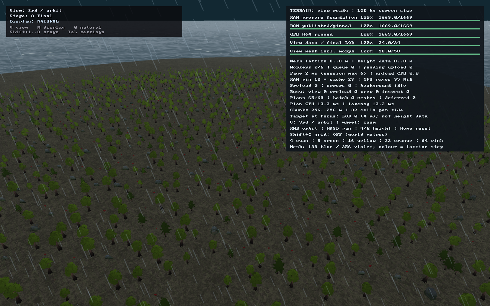
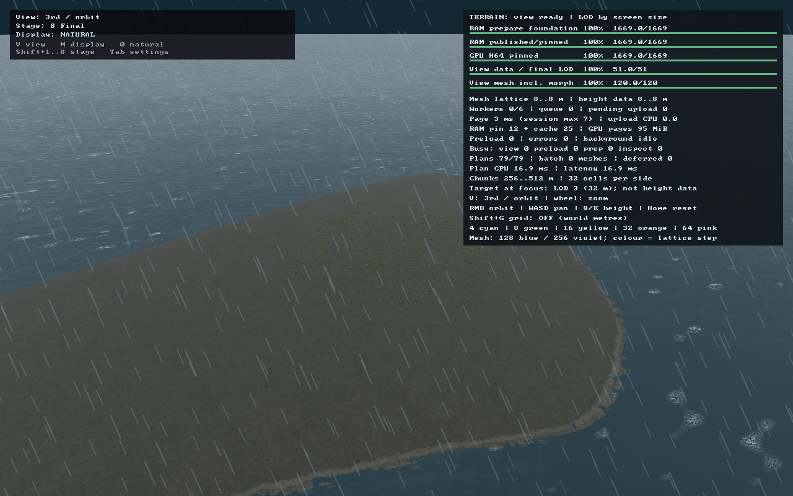
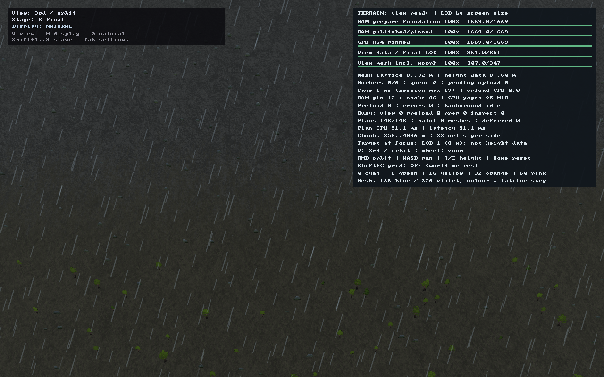
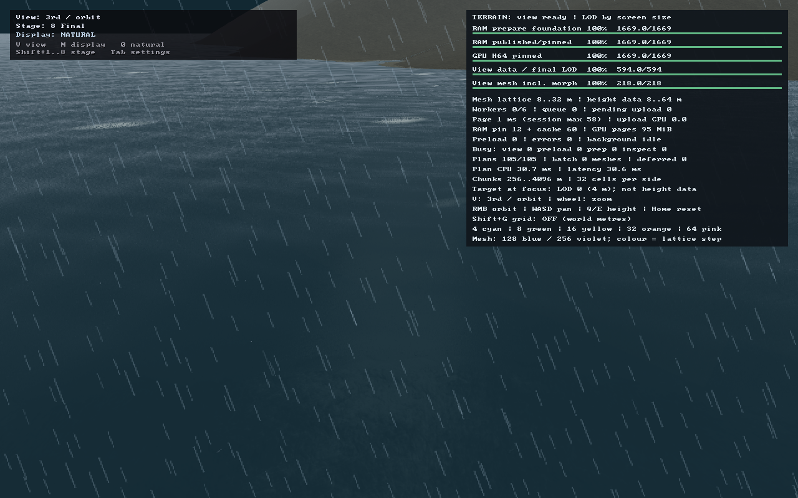

# Шаг 1 / V0 — instanced-модели, LOD и ветер

Дата: 2026-09-15. **Выполнен первый визуальный подшаг V0**; переработка источника
рельефа и увеличение размеров ×4 ещё не выполнены. База разработки — `695608e`
(checkpoint исходной реализации — `d20d224`); изменения этого подшага находятся
в рабочем дереве, отдельный commit пока не создан.

## Что реализовано

- Пять настоящих 3D-моделей из локального `assets/models/Stylized Nature MegaKit[Standard].zip`:
  лиственное дерево, сосна, куст, камень и гриб. Автор Quaternius, лицензия CC0-1.0.
  Исходный текст лицензии копируется в подготовленный набор.
- Общая геометрия на модель, texture arrays для материалов, единый frame instance
  arena. Многочисленные объекты не создают отдельный draw call на экземпляр.
- **LOD по размеру на экране:** full mesh выше 38 px, восьмиракурсный impostor
  ниже 22 px, плавный screen-door переход между ними. Субпиксельные объекты исчезают.
- Impostors запекаются offline из тех же моделей; содержат albedo и normals,
  поэтому освещение не заморожено в текстуре. Есть mip-цепочки, alpha-test,
  normal maps ближней геометрии, общий свет/дымка, затенение у основания и
  пропускание света растительностью. Полноценные динамические тени не добавлялись.
- Небольшое движение растительности от общего поля ветра в vertex shader;
  основание неподвижно, нулевой ветер даёт нулевое смещение, камни и грибы статичны.
- Детерминированная расстановка по seed и мировым координатам. Проверяются суша,
  высота относительно воды, уклон и климат. При движении камеры одинаковые
  объекты сохраняют ID/позиции, меняется только представление.
- Один ограниченный фоновый запрос, собственный HeightField на worker;
  при смене мира задача завершается до уничтожения данных. Маска открытой воды
  проверяется раньше дорогих точечных запросов.
- Импорт подключён к CMake-цели клиента. При обычном повторном build архивы не
  перепаковываются; исходные архивы не изменяются.

## Измерение объектов в реальных кадрах

Мир: seed **42**, **64×64 старых ячеек = 34,56×34,56 км**. Это контрольный небольшой
мир для V0, не новый пресет small и не заявление о готовности масштаба ×4.
Клиент: Metal, кадры **1280×800**, orbit camera, yaw 0,785398 и pitch 0,463648 рад.

| Кадр | Mesh-инстансы | Impostor-инстансы | Draw calls объектов | Треугольники объектов |
|---|---:|---:|---:|---:|
| Лес, близко | 463 | 2001 | **4** | 2 663 895 |
| Тот же лес, далеко | 0 | 3233 | **1** | **6 466** |
| Горный участок | 28 | 232 | **3** | 173 566 |
| Берег / открытая вода | 0 | 0 | **0** | 0 |
| Лес, другой момент ветра | 463 | 2001 | **4** | 2 663 895 |

Дальний вид отправляет примерно **в 412 раз меньше треугольников объектов**,
несмотря на большее число видимых impostors. Это сравнение двух ракурсов/масштабов
одного места, **не замер ускорения GPU в 412 раз**. Во время перехода один объект
может иметь два submission — mesh и impostor; их сумму нельзя считать числом
уникальных видимых объектов.

В лесном рабочем окне: 7718 размещённых объектов из 9216 кандидатных участков.
Общая геометрия пяти моделей: **983 688 байт**; ближний кадр загружает
**137 984 байта** instance data. Прибрежный рабочий набор содержит 44 сухопутных
объекта, но они не видны в выбранном ракурсе; **10 водных тайлов** полностью
пропущены до site sampling. Нулевой draw count берега не объявляется скриншотом
прибрежного декора: этот кадр проверяет отсутствие объектов на воде.

Полные результаты: [metrics.json](metrics.json), плюс `.png.scene.json` рядом
с каждым изображением. В них сохранены точные координаты, команды, матрица камеры,
время шейдера, wind vector, frame count и terrain RAM/cache/GPU counters.
Terrain GPU/RAM counters **не являются общей памятью всех моделей и драйвера**;
геометрия объектов и instance uploads посчитаны отдельно. FPS в этом шаге не
заявляется: длительность процесса включает создание мира, запуск и ожидание кадров.

## Скриншоты клиента

Это PNG, полученные самим клиентом через GPU readback, не CPU/SVG-превью.
На всех итоговых кадрах: terrain pages **100%**, terrain mesh **100%**,
missing = 0, capacityLimited = false, uploadFailed = false; объекты ready = true.

### Лес: ближние meshes и переход к impostors

Фокус **(5130, 7830) м**, zoom 4, shader time 2 с, frame 360.



### Тот же лес на дальнем LOD

Тот же фокус/углы/время, zoom 0,6, frame 360. Все нарисованные объекты — impostors,
переданные одним instanced draw, а не тысячи отдельных sprite draws.



### Горный участок

Фокус **(17550, 17550) м**, zoom 3, shader time 2 с, frame 720.
Первый запуск на frame 360 имел только 89% mesh readiness и был автоматически
переснят; незавершённый кадр не используется как итоговый.



### Берег и открытая вода

Фокус **(6210, 29430) м**, zoom 4, shader time 2 с, frame 360.
Маска исключает морские кандидаты, береговой terrain при этом не удаляется.



### Второй момент ветра

Те же лес/камера/состав объектов, shader time **6 с** вместо 2 с.
Изменения пикселей подтверждают различие кадров, но не изолируют деревья от
анимированной травы/воды. Неподвижный корень/камни проверяются отдельно общей
CPU/HLSL-формулой.


## Проверки

- Клиент собран; новая HLSL-программа успешно компилируется и исполняется в Metal.
- Полный terrain-набор: **155/155**. Семь новых тестов проверяют детерминизм,
  сохранение объектов в пересечении окон, отсечение воды до site queries,
  неподходящие/нечисловые высоты, LOD/азимуты и общую формулу ветра.
- Существующий Metal-набор: **20/20**. Эти 20 тестов не выдаются за новый набор
  GPU-readback тестов объектов: новый pass проверен пятью клиентскими запусками.
- Все пять PNG читаются, имеют размер 1280×800 и непустое содержимое.
- Повторная съёмка проверяет фактическую готовность, делает максимум три запуска
  на место с увеличением frame limit; каждый процесс имеет timeout 120 с.
- numpy 2.5.3 и Pillow 12.3.0 проверены: известных CVE не найдено.
- В IDE Python SDK не настроен, поэтому она не разрешает даже стандартные модули;
  фактические import/capture скрипты успешно выполнены соответствующими Python.
- Полный simulation suite не запускался; прежние независимые legacy-water сбои
  не объявляются исправленными.

## Воспроизведение

Из корня проекта, с установленным окружением из [инструкции](../../scene_models.md):

```sh
cmake --build build --target asr_client asr_terrain_tests asr_height_page_gpu_tests -j 6
./build/asr_terrain_tests
./build/asr_height_page_gpu_tests
python3 tools/capture_scene_models.py
```

Импортёр: `tools/prepare_scene_models.py`.
Графический сценарий: `tools/capture_scene_models.py`.
Команды конкретных кадров сохранены в `metrics.json`.
Логи сборки и тестов: `build/scene-model-{verify-build,terrain,metal}.log`;
логи съёмки рядом с изображениями игнорируются Git, PNG и JSON — нет.

## Границы этого подшага и следующая работа

- Радиус расстановки **768 м**, видимость плавно исчезает между 480 и 600 м;
  это ограниченный локальный слой, не всемирное хранение всей растительности.
- Пока есть full mesh → индивидуальный восьмиракурсный impostor → culling.
  **Объединённые impostors целых рощ, промежуточные упрощённые meshes и
  интерполяция между азимутами ещё не реализованы.** Восемь ракурсов могут давать
  заметную смену силуэта при обходе дерева; это предмет последующей настройки.
- Нет физической коллизии деревьев, постоянных вырубок/перемещений, теневых карт,
  terrain-conforming contact shadows и полноценной сезонной смены модельных текстур.
- Объекты закреплены на канонических высотах, а не на каждой промежуточной плоскости
  LOD-morph. Большие временные расхождения грубой сетки могут требовать отдельной
  коррекции визуальной посадки; шейдерный ветер не должен менять gameplay-height.
- Сохранение кадров и прохождение тестов не означают художественного совпадения
  с `doc/references`. Детальная визуальная оценка пользователем остаётся отдельной
  приёмкой; доступное текстовое чтение файлов её не заменяет.
- Следующий шаг: WorldDomain/ScalePolicy, coarse start 256/512/1024/2048,
  ранняя land mask для самого источника и безопасное включение пресетов ×4.
  В этом подшаге высоты, размеры мира и настройки terrain не менялись.

