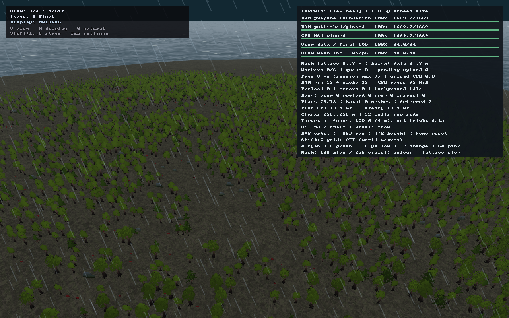
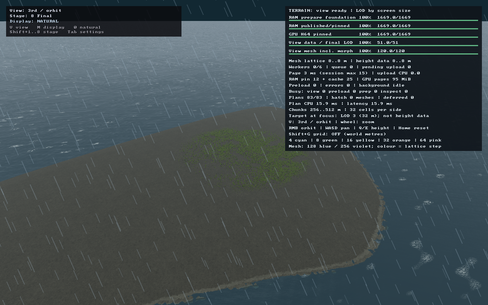
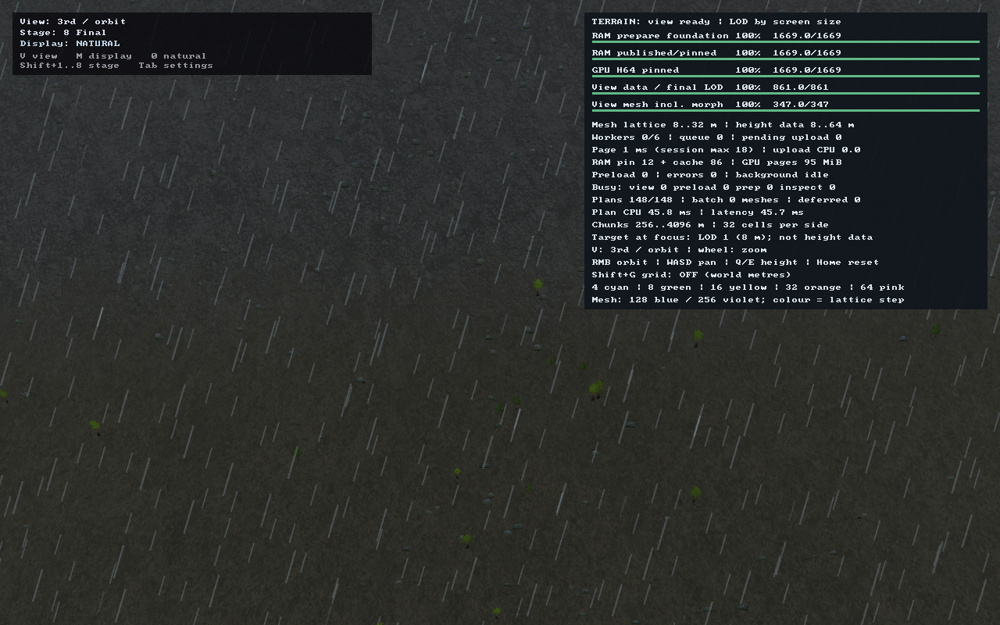
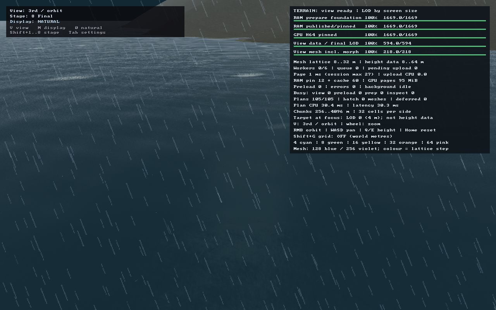

# Шаг 2 — связный густой лес и начало P1

Дата: 2026-09-15. Изменения находятся в рабочем дереве; commit не создавался.

**Завершён визуальный подшаг леса и реализован P1a: контракт физического домена /
политики масштабов.** Новый coarse-источник, streaming и включение presets ×4
ещё не готовы. P1 целиком и общий первый milestone не объявляются закрытыми.

При возобновлении работы реализация `.cpp`, mesh-бюджет и предыдущая версия
этого отчёта уже присутствовали. В этом продолжении исправлено предпочтение
опушек для кустов, добавлено пять регрессионных тестов, заново собран клиент и
пересняты все пять кадров ниже. Существующая работа P1a и `scale-policy.json`
сохранены; новый coarse-источник в этом продолжении не реализовывался.

## Лес вместо равномерной россыпи

- Кандидатный шаг уменьшен **16 → 8 м**, позиции случайно смещены внутри ячейки.
- Связное поле плотности: лесные массивы **512/192 м**, поляны **80 м**, вариация
  небольших групп **32 м**. Поле непрерывно и зависит от seed/мировых координат,
  а не от камеры, порядка загрузки или LOD.
- Частота деревьев следует этому полю, лесному биому, уклону и высотной границе.
  Для кустов и камней используются отдельные шумовые поля **40/112 м**;
  грибы предпочитают лесные участки. Это абсолютные метры, не доли размера мира.
- Кусты предпочитают **полосу промежуточной плотности**, а не пустой центр поляны:
  максимум при плотности 0,2–0,45, плавное ослабление к полянам и ядрам леса.
  До исправления новый опушечный тест падал на всех четырёх seed; после — проходит.
- Сохранены ранняя land-mask проверка и исключение воды, неподходящих склонов и
  нечисловых высот. На полностью морском участке site queries не выполняются.
- На CPU-fixture тестируется **>100 деревьев/га в плотных ядрах** и **>6×** разница
  частоты относительно полян. На seeds 1/7/42/128 соседние значения поля гораздо
  ближе друг к другу, чем значения через 256 м; присутствуют и ядра, и поляны.
- Повторная генерация и пересечение соседних окон сохраняют одинаковые ID,
  позиции, виды и масштабы объектов. Ветер не меняет расстановку.

### Измеренные CPU-fixtures

На ровном полностью лесном участке seed 42: частота деревьев в ядрах **81,697%**,
в полянах **3,995%** кандидатов — примерно **20,45×**, или **127,65 дерева/га**
в ядрах. Это синтетический участок, не средняя плотность всей клиентской карты.

Частота кустов относительно **всех кандидатных мест** соответствующей категории:

| Seed | Поляна, density <0,08 | Опушка, density 0,2–0,45 | Ядро, density >0,75 |
|---|---:|---:|---:|
| 1 | 0,463% | 6,033% | 0,449% |
| 7 | 0,187% | 6,210% | 0,256% |
| 42 | 0,322% | 6,676% | 0,334% |
| 128 | 0,417% | 6,423% | 0,304% |

В fixture с нулевым лесным habitat остаются только камни: **714–748** на окно.
Для счётчиков в 64-метровых квадратах отношение дисперсии к среднему
**1,856–1,996** (тест требует >1,2), что отличает группы от равномерной случайной
россыпи. Дополнительно проверены неизменность размещения при смене породы дерева
и полное совпадение объектов в пересечениях окон по X, Y и диагонали, в том числе
при увеличении физического домена без изменения seed.

## Ограничение нагрузки

Бюджет ближней геометрии — **1 500 000 mesh-треугольников**. При превышении
базового бюджета интервал перехода 22–38 px сдвигается вверх; приоритет получают
крупные экранные силуэты. Одинаковые размеры на границе исключаются вместе,
поэтому сортировка и tie-порядок не могут превысить бюджет. Плавный screen-door
переход сохраняется. Не получивший mesh объект остаётся impostor, а не исчезает.
Новый тест проверяет все 24 перестановки четырёх заявок, включая равные экранные
размеры с разной стоимостью, нулевой бюджет и сохранение coverage при отказе в mesh.

Это бюджет **mesh-геометрии**, не всего кадра: карточки дополнительно требуют
по два треугольника, terrain и вода имеют свои расходы. Ускорение в FPS не заявляется.

В рабочем лесном окне seed 42: **15 000 объектов** вместо прежних 7718, в том числе
**11 010 лиственных + 2419 сосен = 13 429 деревьев**, 873 куста, 503 камня и
195 грибов. Проверено 36 864 кандидатных места. Общая геометрия по-прежнему занимает
**983 688 байт**; нет копии mesh на каждое дерево.

| Контрольный кадр | Mesh-инстансы | Impostors | Draw calls объектов | Mesh-треугольники | Все треугольники объектов |
|---|---:|---:|---:|---:|---:|
| Лес близко | 248 | 4743 | **3** | **1 495 770** | 1 505 256 |
| Тот же лес далеко | 0 | 7770 | **1** | 0 | **15 540** |
| Горы | 14 | 176 | 3 | 78 438 | 78 790 |
| Открытая вода / берег | 0 | 0 | 0 | 0 | 0 |
| Лес, другой момент ветра | 248 | 4743 | 3 | 1 495 770 | 1 505 256 |

Ближний кадр прежнего шага отправлял 2 663 895 треугольников объектов.
Текущий адаптивный mesh-интервал этого кадра — **40,891–70,630 px**.
Mesh/impostor counts включают двойное submission во время перехода и не равны
числу уникальных видимых объектов. Загруженные объекты тоже не все видимы.
На береговом окне **10 морских тайлов** пропущены до точечного sampling.

## Настоящие скриншоты клиента

GPU-readback PNG, **1280×800**, Metal, seed **42**, legacy **64×64 клетки**,
то есть **34,56×34,56 км**. Это не новые размеры ×4. Координаты и углы соответствуют
[шагу 1](../gen_rework_step_1/README.md), поэтому сравнение не меняет место.

На всех итоговых кадрах: pages = 100%, mesh = 100%, missing = 0,
capacity_limited = false, upload_failed = false, final_stage = true; objects ready.
Горный участок автоматически переснят на frame 720 после незавершённого frame 360.

### Лес близко

Фокус (5130, 7830) м, zoom 4, shader time 2 с.



### Тот же лес далеко

Тот же фокус и углы, zoom 0,6; один impostor draw.



### Горы: редкая растительность и каменные группы



### Берег: вода без деревьев

В выбранном ракурсе сухопутные объекты не видны. Кадр проверяет воду, а не
демонстрирует прибрежный декор.



### Лес, shader time 6 с


Оба момента ветра имеют одинаковые focus, population и draw counts.
Ближний и дальний лес также сохраняют все пять population counters и число sampled sites.
Изменились 376 732 пикселя; это сравнение всего кадра, не изоляция деревьев от
анимации травы/воды. Roots и статичные камни проверяются общей CPU/HLSL-формулой.
PNG декодированы и проверены на размер/непустое содержимое. Формальные проверки
и наличие изображений не заменяют художественную визуальную приёмку.

Полные данные: [metrics.json](metrics.json) и `.png.scene.json` рядом с кадрами.

## Продолжение: P1a, не фиктивное включение большого мира

Добавлены `generation/world_domain.*` и `generation/world_scale_policy.*`:

- `WorldDomain`: 64-битные физические width/height/area; normalized UV, обратный
  перевод и метрические градиенты по **обеим осям**; half-open bounds.
- Legacy adapter переводит клетки через неизменные **540 м** и возвращает их без
  округления только для совместимых размеров. Старые WorldMapParams/snapshots не меняются.
- `ScaleRule`: world-relative, bounded semi-relative и absolute параметры.
  Абсолютное значение 8 м остаётся 8 м на 100/250/1000/10 000 км.
- `WorldDescriptor`: явный kind `scale-aware`, версии формата/генератора/policy,
  физический extent, seed, разрешённый coarse-шаг и размеры bounded overview.
  JSON round-trip, строгая проверка чисел/версий и детерминированный fingerprint.
  Этот формат пока резервирует новый режим, **не запускает его генератор**.
- Auto coarse-start выбирает **256/512/1024/2048 м** по extent и бюджету, не по zoom.
  Явный выбор каждого шага также поддерживается. Выбранное значение сохраняется.
- Overview ограничен 1024×1024; прямоугольные карты учитывают aspect ratio.
  Число coarse samples только **оценивается**, не выделяется. Для 10 000 км даже
  H2048 требует paged source, что явно отражено в отчёте.

| Новый descriptor preset | Сторона, км | Выбранный шаг, м | Overview samples |
|---|---:|---:|---:|
| small | 138,24 | 256 | 541×541 |
| medium, default descriptor | 207,36 | 256 | 811×811 |
| large | 276,48 | 512 | 541×541 |
| huge | 414,72 | 512 | 811×811 |

Стороны точно ×4, площади ×16 относительно legacy. **Таблица — descriptor presets,
не переключённое меню клиента.** Нельзя передать эти размеры прежнему H64 bake:
для huge он превышает существующую защиту 16 777 216 отсчётов.

`world_scale_policy_probe` проверил **24 descriptor-сценария**, включая
seeds 1/7/11/42, 100/250/1000/10 000 км, прямоугольные карты и новые presets.
Результат: [scale-policy.json](scale-policy.json). В нём явно указаны
`terrain_generated=false`, `runtime_presets_changed=false`, `height_samples_allocated=0`.
Это не `world_scale_probe` готовой композиции и не замер памяти реального источника.

## Проверки и воспроизведение

- Клиент, `asr_tests`, terrain- и GPU-наборы повторно собраны. В изменённых C++ нет compile errors;
  linker повторяет предупреждение о duplicate SDL/world libraries.
- Полный `asr_terrain_tests`: **170/170**, включая **16/16 scene** и 6 world-scale тестов.
- Существующий Metal/GPU terrain-набор: **20/20**; не выдаётся за новые unit GPU-тесты леса.
- Пять bounded client runs проверяют readiness, шейдеры, population accounting,
  draw budget и фактически отправленные mesh-треугольники.
- Повторный полный общий `asr_tests` **не прошёл**: `ground_texture_scales_match_the_large_pattern_defaults`
  сообщает несовпадения масштабов, затем worldgen-проверки останавливаются с
  `H64 foundation exceeds supported world size`. Эти независимые от нового scatter
  области здесь не исправлялись; ошибки совпадают с предыдущим отчётом.
  Полный suite не объявляется зелёным.
- Python работает в фактическом окружении; IDE без Python SDK не разрешает даже
  стандартные `argparse/json`, что не является ошибкой исполнения capture-скрипта.

```sh
cmake --build build --target asr_client asr_tests asr_terrain_tests asr_height_page_gpu_tests -j 4
./build/asr_terrain_tests scene_
./build/asr_terrain_tests
./build/asr_height_page_gpu_tests
python3 tools/capture_scene_models.py --output doc/reports/gen_rework_step_2
```

Свежие логи: `build/gen-rework-step-2-{build,scatter-tests,terrain-tests,gpu-tests,unit-tests,captures}.log`.
Воспроизведение ошибки до исправления: `build/gen-rework-step-2-before-tests.log`.
Логи отдельных кадров — рядом с PNG. Предыдущие P1a-логи
`build/world-domain-forest-{build,terrain-tests,gpu-tests}.log` сохранены.

## Следующий незавершённый шаг

Нормализованный macro/coarse-источник, ранняя консервативная LandCoverage и bounded
streaming без всемирного H64 bake, затем подключение новых descriptor presets ×4
в меню/CLI и их реальные client smokes. Только после этого можно закрывать P1 gate.
H16 erosion, aggregate impostors рощ, shadow maps, collision и постоянные вырубки
не реализованы в этом подшаге. Радиус декора остаётся локальным: 768 м генерации,
480–600 м fade видимости.

