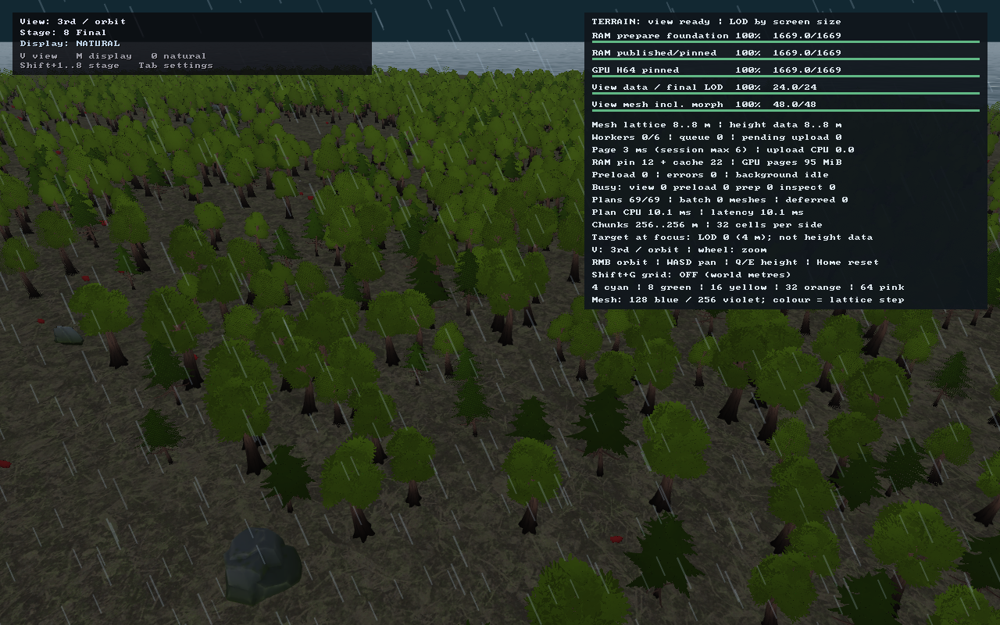
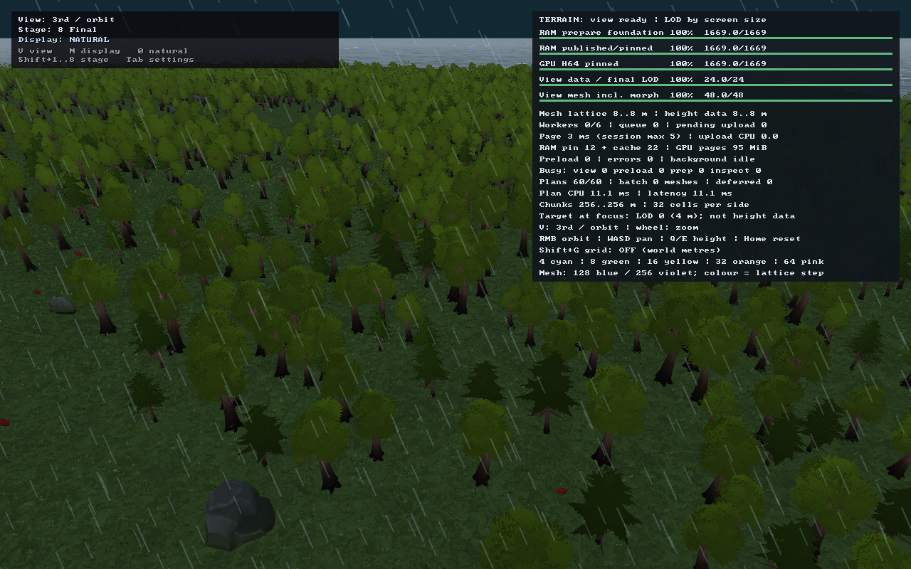
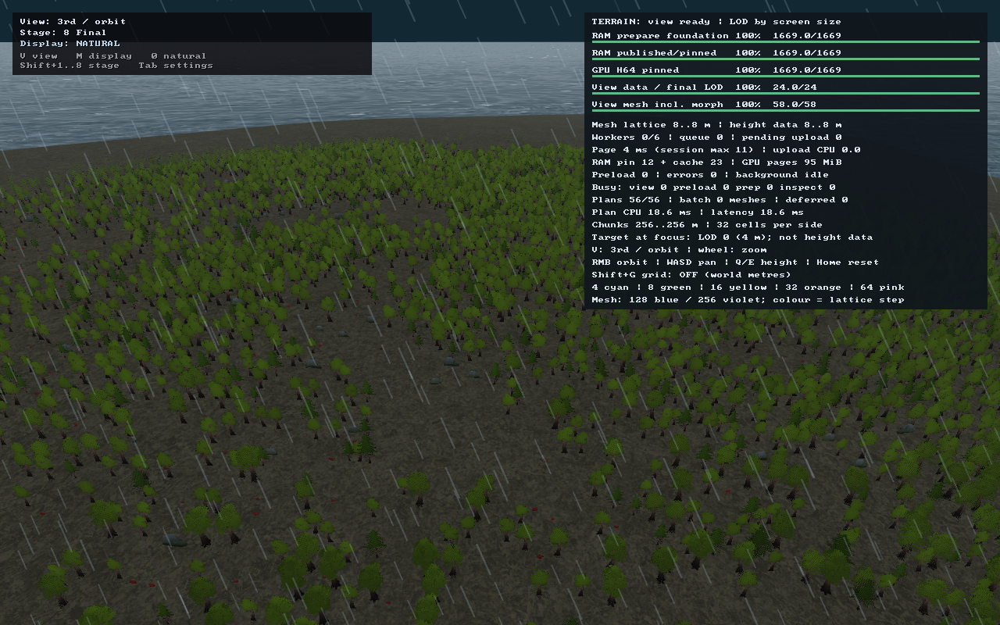
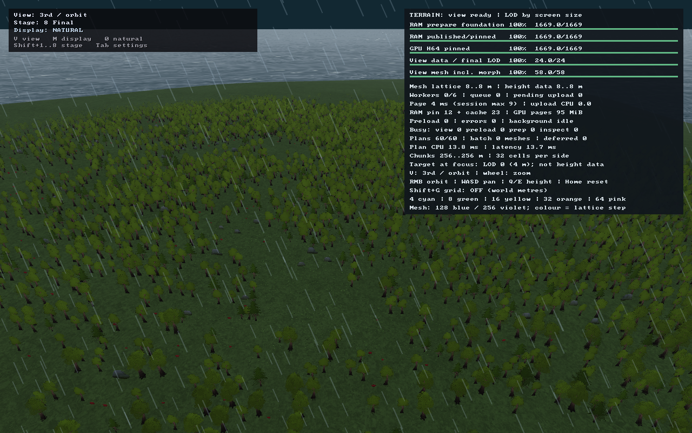
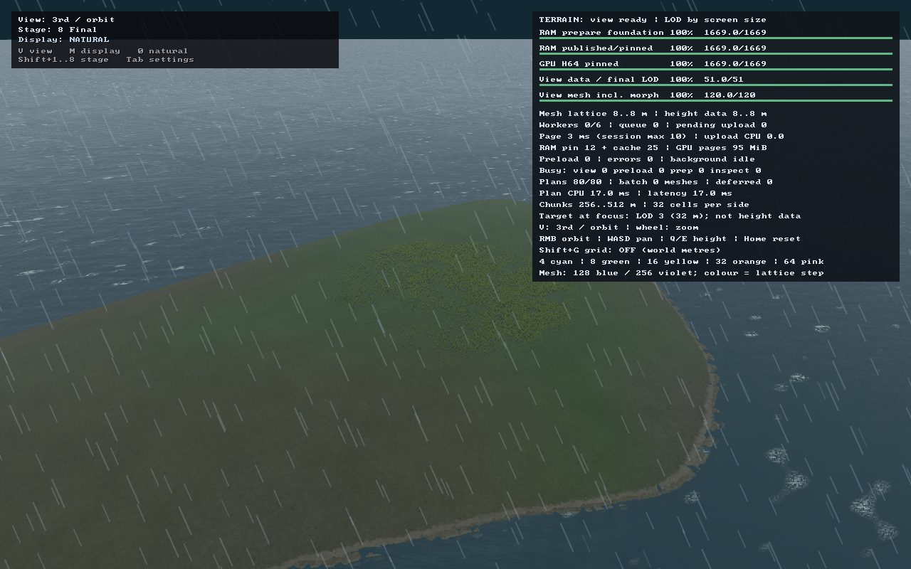

# Шаг 3 — согласованное покрытие грунта и трава на adaptive terrain

Дата проверки: **2026-09-16**. Изменения в рабочем дереве, без commit.

## Исправление SIGBUS после первоначальной проверки

Три crash reports macOS от 00:08–00:10 показали один стек:
`FoliagePass::collect → InstanceArena::add → _platform_memmove`,
`EXC_BAD_ACCESS / KERN_PROTECTION_FAILURE / SIGBUS`. UUID совпал с
`cmake-build-debug/asr_client`, то есть с Debug-клиентом CLion.

В `add(data, count, stride)` ошибочно передавалось `count * sizeof(PageGrassRoot)`
вместо количества элементов. `memcpy` умножал это число на stride повторно и
**читал за пределами исходного массива**. Для 65 536 корней по 28 байт запрашивалось
51 380 224 байта вместо 1 835 008. Это ошибка нового прохода травы, не драйвера Metal.
Первоначальные проверки PNG и количества draw-инстансов не покрывали этот контракт
копирования; их успешность не была гарантией безопасности памяти.

Исправлено: используется типизированный `InstanceArena::add(span)`; число элементов
и stride выводятся из диапазона. В grass-метаданные добавлены измеренный прирост
арены `instance_upload_bytes` и `instance_stride_bytes`. Capture-проверка сравнивает
реальные скопированные байты с количеством корней, учитывая только выравнивание.

Пересобраны `cmake-build-debug/asr_client` и `build/asr_client`.
Новые тесты арены **3/3** проходят в обеих конфигурациях: полный бюджет корней,
несколько партий/выравнивание/пустые диапазоны и массив, оканчивающийся непосредственно перед
защищённой `PROT_NONE` страницей. Повторные проверки: arena + foliage/climate
**13/13**, terrain **173/173**, Metal/GPU **20/20**.
Debug-кадр леса после исправления измеряет ровно **1 835 008 байт** arena upload.
Логи исправления: `build/grass-sigbus-{debug-build,debug-tests,release-build,release-tests,terrain-tests,gpu-tests}.log`.

После исправления завершились **7/7 Debug-сценариев** с `MallocGuardEdges=1`
и `MallocScribble=1`, а также **7/7 сценариев основной сборки**. Все измеренные
копирования укладываются в число корней × 28 байт; в береговом кадре — ноль.
Debug-проверка дождалась готовности гор на frame 2160 и берега на frame 1440;
повторные попытки связаны с readiness, не с падением. Debug-кадры и JSON находятся
в `build/grass-sigbus-debug-captures/`, логи двух прогонов —
`build/grass-sigbus-{debug,release}-captures.log`.
Основные PNG и `metrics.json` ниже пересняты уже исправленной сборкой.

```sh
cmake --build cmake-build-debug --target asr_client asr_ring_tests -j 4
./cmake-build-debug/asr_ring_tests instance_arena
env MallocGuardEdges=1 MallocScribble=1 .cache/terrain-reference-tools/bin/python tools/capture_vegetation_cover.py --client cmake-build-debug/asr_client --output build/grass-sigbus-debug-captures
```

## Что исправлено

1. **Земля и растения используют общую биомную палитру.** На лесной почве появляется
   травяно-мшистое покрытие, в степи сохраняется более сухой оттенок. Это постоянный
   слой на всех дистанциях, а не замена коричневого материала зелёным при появлении LOD.
   Исходные albedo, зерно, normal maps и свойства материала сохраняются.
2. **Границы биомов читаются в fragment stage по мировым координатам.** Они больше
   не зависят от интерполяции между вершинами всё более крупных треугольников.
   Существующие три климатические текстуры используются повторно, в том числе после
   замены мира. Новая всемирная GPU-текстура не создавалась.
3. Свободный канал третьей климатической плоскости хранит **64-метровое представление
   того же forestDensity(seed, x, y)**, что размещает деревья. Точный scatter деревьев
   не менялся. Это низкочастотное представление массивов, не точная маска каждой кроны
   и не сохранение всех 32-метровых деталей рощи на 64-метровой решётке.
4. **Трава подключена к действующему adaptive terrain.** Старый FoliagePass читал
   mesh-cache, куда активный TerrainCollectPass отправляет море, но не траву старых
   ring meshes. Новый путь берёт корни с настоящих треугольников текущего cut.
5. Корни хранят source/parent/prior высоты, включая stitched edges. При морфинге
   они следуют поверхности, а не независимому heightfield. Положение на мировой
   сетке детерминировано и не выбирается заново при смене детализации треугольников.
6. Лесная почва теперь тоже пригодна для травы: отдельные растения допускаются
   внутри леса, с меньшей частотой под плотным пологом. Вода, песок/марш, скалы,
   снег, неподходящие уклоны и высота выше границы леса исключаются.

## Ограничения нагрузки

- Кандидатная сетка травы: **2 м**, окно генерации **512×512 м**, фокусная область 64 м.
- Не более **65 536 кандидатов**, **131 072 отправленных треугольников карточек**.
- Видимость плавно затухает на **144–192 м** от фокуса и по экранному размеру.
- Корни кэшируются по immutable adaptive mesh и окну; старые записи удаляются.
  На контрольных лесных кадрах кэш корней — **1 835 008 байт**.
- Здесь нет дополнительных процедурных height/water запросов на render thread:
  CPU интерполирует готовые треугольники, GPU использует resident pages и климат.
- Новый GPU-проход отбрасывает неподходящих кандидатов. Счётчики ниже — **submission**,
  не число видимых/принятых травинок. На дальнем кадре кандидаты всё ещё отправляются;
  отдельное GPU compaction/indirect culling в этом шаге не реализовано.
- Бюджет деревьев/камней **1 500 000 mesh-треугольников** сохранён. Трава имеет свой
  отдельный лимит; он не включён в этот бюджет. Ускорение в FPS не заявляется.

| Кадр | Кандидаты травы | Grass draws | Mesh-треугольники объектов | Impostor-инстансы объектов |
|---|---:|---:|---:|---:|
| Лес, zoom 12 | 65 536 | 6 | 1 498 585 | 2845 |
| Лес, zoom 4 | 65 536 | 6 | 1 495 770 | 4743 |
| Лес, zoom 0,6 | 65 536 | 6 | 0 | 7770 |
| Горы | 65 536 | 9 | 78 438 | 176 |
| Берег / вода | 0 | 0 | 0 | 0 |
| Лес, другой момент ветра | 65 536 | 6 | 1 495 770 | 4743 |

Число деревьев в лесном окне не изменилось: **11 010 лиственных + 2419 сосен**,
всего по-прежнему **15 000 объектов** с кустами, камнями и грибами.

## Реальные кадры до / после

GPU-readback PNG, **1280×800**, Metal, seed 42, legacy world 64×64 клетки
(34,56×34,56 км). Во всех итоговых кадрах terrain pages/mesh = 100%, missing = 0,
capacity_limited = false, upload_failed = false, final_stage = true, objects ready.

Точки, проекции, время шейдеров и populations проверены одинаковыми с исходными
кадрами; изменение оттенка не объясняется переносом камеры в другой лес.

| Дистанция | До | После |
|---|---|---|
| Близко, zoom 12 |  |  |
| Средняя, zoom 4 |  |  |
| Далеко, zoom 0,6 |  |  |

### Проверка только травы

В паре [с травой](forest-close.png) / [без травы](forest-close-no-grass.png)
одинаковы грунт, камера, время, деревья и их LOD submission. Отключён только
FoliagePass через диагностическую переменную `ASR_GRASS_DISABLED=1` в дочернем
процессе съёмки. **Изменились 35 925 пикселей**: трава действительно видна, а не
только числится в instance buffer. Переменная не меняет цвет грунта и не служит LOD.

Дополнительные кадры: [горы](mountains.png), [берег](coast.png), [ветер](forest-wind.png).
PNG декодированы и проверены, но это не заменяет художественную приёмку изображения.
Средние RGB в JSON относятся ко всему кадру, не к изолированному грунту.

## Проверки и воспроизведение

- Клиент и тестовые цели собраны, новые шейдеры выполнены на Metal.
- Полный `asr_terrain_tests`: **173/173**, включая **19 scene-тестов**.
- `asr_ring_tests foliage climate`: **10/10**; совместимость legacy пути сохранена.
- `asr_height_page_gpu_tests`: **20/20**. Расширенная цветовая проба выполняет
  7 сценариев покрытия × 6 footprint × 3 rotation = **126 комбинаций** сверх
  существующих material checks. Проверяется общий production C++/HLSL-код палитры;
  реальные новые texture bindings проверены клиентскими запусками.
- Корни проверены на полноту/уникальность, бюджет, смену фокусного окна и геометрии,
  source/parent/prior морф-высоты, stitched edges и исключение skirt walls.
- **7** клиентских кадров, плюс сохранённые **3 исходных** для сравнения.
- `git diff --check` прошёл. IDE без Python SDK по-прежнему не разрешает даже
  стандартные модули Python; capture-скрипт успешно исполнен в существующем venv.
- Общий `asr_tests` в этом шаге не запускался заново. Его прежние ошибки масштабов
  текстур и `H64 foundation exceeds supported world size` из шага 2 здесь не
  исправлялись. Весь проектный suite не объявляется зелёным.

```sh
cmake --build build --target asr_client asr_terrain_tests asr_ring_tests asr_height_page_gpu_tests -j 4
./build/asr_terrain_tests
./build/asr_ring_tests foliage climate
./build/asr_height_page_gpu_tests
.cache/terrain-reference-tools/bin/python tools/capture_vegetation_cover.py
```

[metrics.json](metrics.json) содержит все 7 кадров; [vegetation_checks.json](vegetation_checks.json)
— результаты A/B и сравнения с исходными кадрами. Полные `.png.scene.json` рядом
с изображениями. Логи: `build/gen-rework-step-3-{build,terrain-tests,ring-foliage-climate-tests,gpu-tests,captures}.log`.

## Граница этого шага

Это исправление покрытия, сопряжения LOD и настоящего подлеска. **Форма гор,
долин и берегов не изменялась**; переход к новому coarse-источнику/P1 не закрыт.
Пока нет агрегированных impostors рощ, теневых карт полога, взаимодействия с травой
или сохранения вырубок. Следующая работа с формой рельефа требует отдельного набора
сравнительных кадров и критериев, а не очередной перекраски поверх прежней формы.

