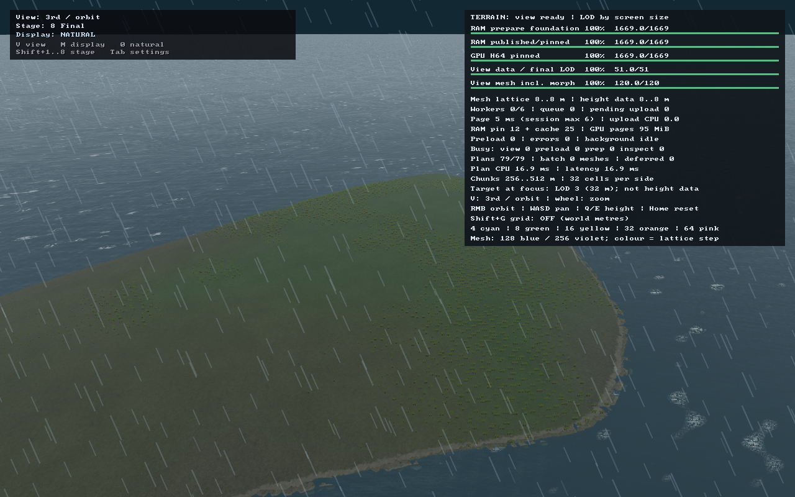
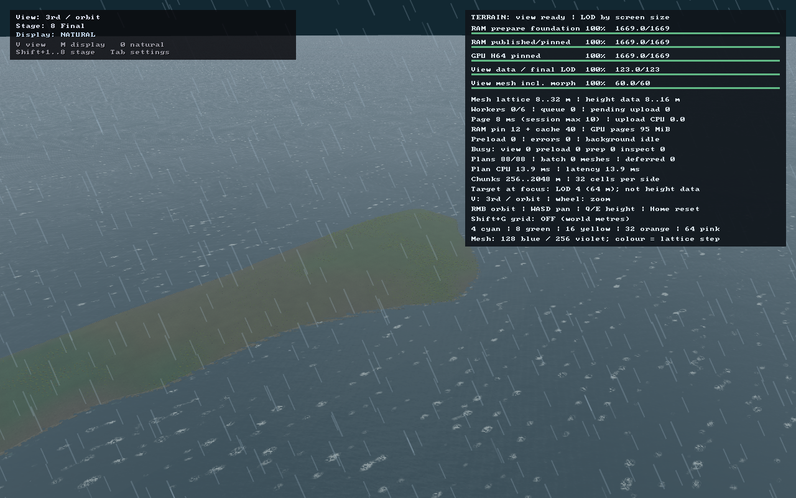
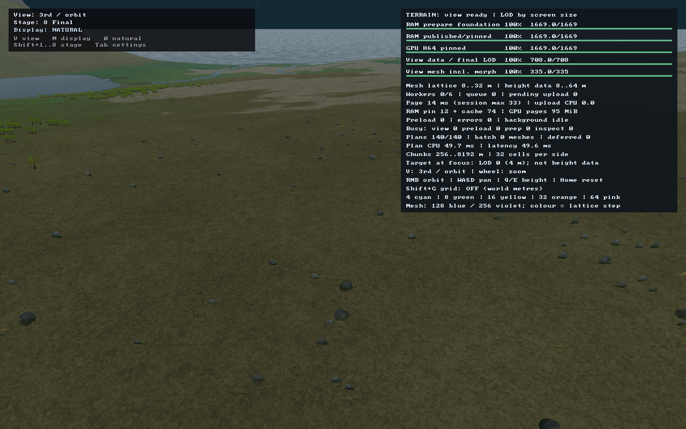

# Шаг 4 — растительность всей видимой сцены и отдельные луга / леса

Дата: 2026-09-16. Правки в рабочем дереве; commit не создавался.
Финальная техническая проверка завершена: повторно прошли **11/11** сценариев,
включая высотную пару свободной камеры. Визуальная художественная приёмка остаётся отдельной.

## Почему раньше были видны «чанки растительности»

Деревья генерировались только в локальном окне, а видимость затухала к 600 м.
Трава имела отдельное окно с fade к 192 м. Снаружи оставался лишь цвет земли.
Это были ограничения резидентности, ошибочно использованные как предел видимости,
а не полноценная цепочка LOD.

Кроме того, сумма boreal/temperate/tropical обозначала палитру растений, но
использовалась как пригодность для леса. RiverValley/Delta получали ту же палитру,
что лес, по температуре — и тем самым слишком много деревьев.

## Новая схема

- **Покрытие грунта** присутствует на всех LOD, в том числе когда
  отдельные растения уже меньше пикселя.
- **Дальние рощи** строятся для всех отображаемых adaptive terrain blocks, а не
  только вокруг фокуса. Используются отдельные восьмиракурсные impostors: каждая
  картинка содержит группу из девяти деревьев, а не одну растянутую гигантскую модель.
- Их опоры берутся с готовых треугольников, с учётом parent morph и stitched edges.
  Климат, водные высоты и forest cover читаются из уже готовых полей. Дополнительной
  точечной генерации HeightField для дальнего леса нет.
- **Точная расстановка загружается только при нужной экранной детализации**:
  hysteresis 14/20 px для оценки дерева у фокуса. До готовности остаются рощи.
  После готовности — плавное замещение за примерно 0,5 с и пространственный
  переход 360–560 м. Старый радиус теперь ограничивает точные данные, не весь лес.
- Для перспективной камеры экранный масштаб определяется проекцией и глубиной
  готовой поверхности terrain около фокуса (`GpuTerrain::vegetationPixelsPerMetre`),
  а не одним zoom. Без готовой поверхности сохраняется грубое представление;
  дополнительных точечных запросов HeightField для этой оценки нет.
- Центр ближнего представления сглаживается при обычном движении. При большом
  переносе камеры старый центр не может вырезать дыру в дальних рощах.
- **Трава**: ближние корни на 2 м сетке плюс более широкие группы во всех видимых
  блоках. Их покрытия комплементарны; за 192 м исчезают отдельные ближние травинки,
  но не вся растительность. Дальние группы имеют экранное затухание, а не
  глобальный обрыв по расстоянию от фокуса.
- Шаг дальних сеток учитывает LOD конкретного блока. Дальний горизонт не заставляет
  все соседние с камерой блоки перейти на ту же грубую сетку.

## Отдельные биомы и открытые области

`SurfaceClimate::woodland` теперь отделён от палитры травы:

- TemperateForest / Taiga / TropicalForest: полноценный древесный habitat;
- Steppe / Tundra / Alpine / Desert / Ice: нулевой древесный habitat;
- Mediterranean / Savanna: редкий, 1/8;
- RiverValley: 1/6; Delta: 1/16.

Atlas forest cover хранит woodland × seeded forest density. GPU остаётся на трёх
RGBA-плоскостях; отдельный CPU woodland-канал сохраняет корректность ClimateField::at.
Шум лесных массивов имеет более выраженные нулевые области; постоянная вероятность
дерева при нулевой плотности удалена. Трава там сохраняется.

Чистые степные, тундровые, альпийские и пустынные fixtures проверяются на **нулевое
лесное покрытие**, независимо от цвета травы. Для seeds 1/7/42/128 синтетический
лесной домен содержит >10% полностью открытых точек и >5% плотных ядер. Нулевые
участки не получают деревья. В плотных ядрах fixture остаётся **127,68 дерева/га**.

В контрольном лесном окне seed 42 теперь **7725 деревьев**, ранее было 13 429.
Раскладка изменилась намеренно вместе с моделью лесных / открытых областей;
стабильность внутри этой версии и в пересечениях окон сохранена.

## Измерения реального клиента

Metal, PNG 1280×800, seed 42, legacy world 64×64 (34,56×34,56 км), shader time 2 с.
Все кадры: objects ready, pages/mesh = 100%, missing = 0, final_stage = true,
capacity_limited = false, upload_failed = false.

| Кадр | Точные деревья в резидентном окне | Impostors рощ | Блоки с рощами | Дальность от фокуса | Near / far grass candidates |
|---|---:|---:|---:|---:|---:|
| [Лес близко, zoom 12](forest-close.png) | 7725 | 909 | 26 | 1601 м | 65 536 / 49 152 |
| [Лес, zoom 4](forest-near.png) | 7725 | 1027 | 32 | 1601 м | 65 536 / 14 848 |
| [Лес далеко, zoom 0,6](forest-far.png) | **0** | **3049** | **82** | **1877 м** | **0 / 32 217** |
| [Широкий план, zoom 0,25](forest-wide.png) | **0** | **4617** | **37** | **3997 м** | **0 / 19 370** |
| [Сдвиг фокуса на 512 м](forest-pan.png) | 0 | 3000 | 76 | 2141 м | 0 / 32 217 |
| [Возврат к исходному фокусу](forest-return.png) | 0 | 3049 | 82 | 1877 м | 0 / 32 217 |
| [Степной landmark](steppe.png) | 885 | 1615 | 74 | 23 739 м | 65 536 / 39 066 |
| [Долина](valley.png) | 367 | 57 | 4 | 877 м | 65 536 / 18 175 |
| [Берег](coast.png) | 90 | 1300 | 75 | 22 693 м | 0 / 38 638 |
| [Свободная камера, height-offset 80 м, zoom 12](forest-free-low.png) | 7725 | 931 | 27 | 1701 м | 65 536 / 51 200 |
| [Свободная камера, height-offset 2000 м, zoom 12](forest-free-high.png) | **0** | **82** | **7** | **1701 м** | **0 / 22 006** |

Степной landmark — смешанное окно и вид на соседние биомы, **не утверждение, что
все видимые 24 км являются степью**. Наличие там дальних рощ не означает деревья
в чистом степном habitat; отсутствие последних проверяется отдельно на fixtures.
Береговой широкий вид также может видеть леса на суше вокруг воды.

Четыре дальних орбитальных сценария и верхний свободный ракурс стартуют холодными:
**sampled_sites = 0**, точные деревья не генерировались, ближняя трава не загружалась.
Панорамирование/возврат здесь —
отдельные bounded client runs, не непрерывная запись движения камеры. Стабильность
мировых опор при разбиении quadtree дополнительно проверяется CPU-тестом.

### Высота свободной камеры при одинаковом zoom

У `forest-free-low` и `forest-free-high` совпадают фокус, XY камеры, viewport и
**zoom = 12**. Отличаются `--height-offset 80` и `2000`: разница высот камеры —
**1920 м**. Внизу запрошена и загружена точная расстановка, присутствуют mesh-модели;
наверху `detail_requested = false`, `sampled_sites = mesh_instances = 0`,
ближних кандидатов травы нет. Сохраняются 82 рощи и 22 006 дальних кандидатов травы
в 86 блоках; дальность рощ 1701 м превышает прежнее локальное окно 768 м.

Проверки разделены по назначению:

- Для `forest-far`, `forest-wide`, `forest-pan`, `forest-return` сохранены прежние
  минимумы **100 рощ / 10 блоков с рощами**.
- Верхний свободный ракурс смотрит на другую часть леса и требует наличия рощ
  (**не менее 1 рощи / 1 блока**), а не плотности орбитального кадра. Числа 82/7 —
  измерение этого ракурса, не новый жёсткий порог.
- Для всех пяти дальних кадров неизменны дальность рощ **>768 м**, минимум
  **10 блоков дальней травы**, отсутствие запроса/генерации точной расстановки
  и ближней травы. Общие проверки бюджетов и instance upload также сохранены.

После повторного прогона дополнительно проверены соответствие метаданных всем
11 PNG, инварианты высотной пары и отклонение **19/19** искусственных нарушений
счётчиков существующим capture-валидатором. Это одноразовая проверка защитных условий,
не ещё 19 запусков клиента. Результат: [final-checks.json](final-checks.json).

### Непрерывное движение и завершение ближней загрузки

Дополнительно выполнен **900-кадровый** прогон `--trace`: начальное ожидание,
панорамирование на **3840 м**, приближение и удержание камеры после кадра 300.
В лог записаны **196 контрольных отсчётов** тех же счётчиков растительности,
которые используются для снимков.

В этом прогоне запрос точной расстановки впервые наблюдался на кадре **245**,
а готовое ближнее представление — на кадре **300**. На всех 11 отсчётах ожидания
245–295 сохранялись impostors рощ. После начального ожидания не было отсчётов
без растительности; минимум дальних рощ — **1198**. Во всех отсчётах
соблюдены бюджеты моделей, рощ, травы и фактического копирования instance-данных.
Это проверка непрерывной работы и доступности представления, **не видеозапись
и не доказательство отсутствия любого визуального изменения LOD**.

Результат: [motion-checks.json](motion-checks.json).
Отдельно выполнен стандартный 300-frame trace в пересобранном клиенте CLion Debug:
76 отсчётов, та же дистанция 3840 м, готовое ближнее представление наблюдалось на
кадре 290; проверка бюджетов и fallback также прошла. Лог и результат находятся в
`build/gen-rework-step-4-debug-motion.log` и `build/gen-rework-step-4-debug-motion-checks.json`.
Расширенная CPU-регрессия также покрывает LOD-ячейку крупнее отдельного чанка:
при разбиении родителя не возникают пропавшие или дублирующиеся опоры.

### Дальний лес



### Более широкий план



### Открытая местность



## Бюджеты и ограничения

- Mesh-бюджет точных моделей: **1 500 000 треугольников**, сохранён.
- Дальние рощи: до **32 768** карточек; общий impostor batch, не draw на дерево.
- Трава: до **65 536** ближних и **65 536** дальних кандидатов. Все загрузки через
  типизированный span; измеренные upload bytes проверяются с учётом выравнивания.
- Кандидаты травы включают GPU-отброшенные экземпляры, это не число видимых травинок.
- Цена видимости всей сцены — больше grass draw calls: например 120 в дальнем лесу
  и 341 в широком степном ракурсе. GPU compaction / indirect batching ещё нет;
  ускорение в FPS не заявляется.
- Impostor-группа — приблизительное представление рощи, не точные позиции девяти
  будущих деревьев. Именно точная раскладка появляется при ближней детализации.
- Группы ещё не имеют отдельных карт глубины и теней полога. Новая работа касается
  резидентности, представления и биомов, а не изменения формы гор и долин.
- Дальние кусты/камни не получили отдельные aggregate LOD в этом шаге.
- Режим нового большого мира / P1 этим не закрывается; тестовый мир остаётся legacy.

## Проверки

- Полный `asr_terrain_tests`: **176/176**, в том числе новые woodland/open-meadow и
  view-wide quadtree регрессии.
- `asr_ring_tests instance_arena foliage climate`: **13/13**.
- `asr_height_page_gpu_tests`: **20/20**.
- Debug arena guard-page проверки: **3/3**; исправление прежнего SIGBUS сохранено.
- Эти CPU/GPU/Debug-наборы повторно выполнены при финальной проверке.
- **11/11** bounded client capture scenarios, контроль cold far residency и бюджетов,
  включая свободную камеру на двух высотах при одинаковом zoom. Все кадры готовы к frame 720.
- Непрерывный 900-frame pan/zoom/settle trace и 196 проверенных отсчётов.
- Основной `build/asr_client` и **`cmake-build-debug/asr_client`** для CLion собраны
  с последней правкой проекции; повторный `cmake --build` подтвердил актуальность обоих.
- **11/11 PNG** декодированы, размер 1280×800 и непустое изображение проверены;
  художественная визуальная приёмка не подменяется счётчиками.
- Общий `asr_tests` не объявляется зелёным: ранее известные ошибки вне этого шага
  не исправлялись. Сообщения IDE о Python SDK не соответствуют фактическому успешному
  выполнению подготовки ассетов и capture-инструмента.

```sh
cmake --build build --target asr_client asr_terrain_tests asr_ring_tests asr_height_page_gpu_tests -j 4
cmake --build cmake-build-debug --target asr_client asr_ring_tests -j 4
./build/asr_terrain_tests
./build/asr_ring_tests instance_arena foliage climate
./build/asr_height_page_gpu_tests
./cmake-build-debug/asr_ring_tests instance_arena
python3 tools/capture_vegetation_lods.py
ASR_VEGETATION_TRACE_SETTLE=1 ./build/asr_client --explore --seed 42 --world 64 --at forest --camera orbit --zoom 0.6 --trace > build/gen-rework-step-4-motion.log 2>&1
python3 tools/verify_vegetation_trace.py
```

[metrics.json](metrics.json) содержит команды и полные метаданные всех кадров.
Логи: `build/gen-rework-step-4-{build,terrain-tests,ring-tests,gpu-tests,captures}.log`,
`build/gen-rework-step-4-debug-{build,tests}.log`. Финальное подтверждение сборок:
`build/gen-rework-step-4-resume-build.log` и `build/gen-rework-step-4-debug-projection-build.log`.
Одноразовая проверка защитных условий: `build/gen-rework-step-4-capture-assertions.log`.
Предыдущие отчёты сохранены как
история прежних алгоритмов; их численные популяции не являются контрактом этой версии.
Непрерывный trace: `build/gen-rework-step-4-motion.log`.

