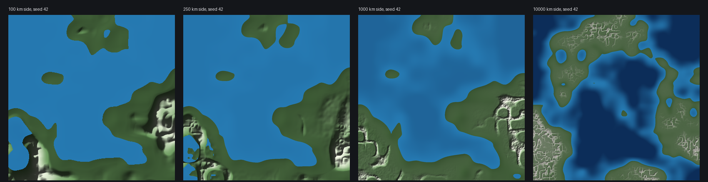

# Шаг 6 — **НЕ ЗАВЕРШЁН**: источник большого мира без мировых массивов

Статус на 2026-09-16: это **часть** пакета из раздела 6 плана, а не выполненный
пользовательский шаг. Здесь нет ни одного кадра клиента, потому что источник
**ещё не подключён к рендереру, streaming-очередям и пресетам ×4**. Каталог
создан заранее: когда пакет будет доведён до конца, отчёт дописывается здесь же
и получает реальные скриншоты по разделу 8.

Не считать шаг выполненным, пока в этом каталоге нет кадров клиента.

## Почему legacy-путь не расширяется, а заменяется

Дело не в скорости — в мировых массивах. `TerrainFoundation` — пять плотных
плоскостей H64: на пресете 414 км это **больше гигабайта**, на 10 000 км —
число, которое нет смысла выписывать. `LandMask64` — бит на каждые 64 м мира.
`HeightField` присоединяет весь макрокарту целиком. Увеличить допустимый
`--world` поверх них — ровно то, что план называет невыполненной задачей.

Сделаны три модуля, ни один из которых не держит ничего размером с мир.

## `generation/world_macro.*` — композиция

`MacroField::at(x, y)` даёт высоту, континентальность и силу пояса в любой
точке, в метрах, не зависит от порядка запросов и ничего не кэширует.

**Континент — world-relative**, всё остальное — semi-relative в метрах. Кроме
того, кора несёт метрический член: без него композиция была бы одинаковой на
всех размерах — «тот же рисунок, растянутый», который план запрещает.

Рельеф — три слоя, а не одна стопка октав (стопка октав даёт смятый лист:
одинаково шероховато везде, ни равнины, ни хребта, ни котловины):

- **Цепи** — ridged-октавы только внутри скелета пояса, привязанного к
  континентальной окраине: горы стоят за прибрежной равниной, а не посреди
  абиссали. Внутренние области сохраняют 30% поднятия — старые низкие горы.
- **Равнины** — низкий округлый слой по всей суше, которой на континенте больше всего.
- **Платформа** — широкий региональный наклон: котловины и плато.

Три вещи, которые пришлось исправить, и каждая была настоящей ошибкой, а не
настройкой вкуса:

1. **Профиль шельфа ограничен уклоном, а не глубиной.** Мир 100 км не вмещает
   континентальную окраину, которая в реальности шириной в сотню километров:
   требование упасть на 4 км давало обрыв с уклоном 2,5 — и гигантскую
   константу Липшица, из-за которой маска не могла доказать вообще ничего.
   Вертикальный размах теперь масштабируется так, чтобы уклон не превышал
   `kMarginSlope`, и полной абиссальной глубины достигает только большой мир.
   Это то же рассуждение, что и растущий стартовый шаг.
2. **Уровень моря — перцентиль ограниченного обзора, а не константа.**
   Континентальный член world-relative, поэтому на маленьком мире он
   укладывается в считаные ячейки решётки, и при фиксированном пороге доля суши
   была **лотереей**: одна смена хеш-функции сдвинула её с трети мира до
   одной двадцать пятой, а «мир на девять десятых океан» план называет прямо.
   Теперь обзор — это весь мир при ограниченном разрешении, и уровень моря
   берётся как его перцентиль: доля суши **ровно 38% на любом размере и seed**.
3. **Длины волн укорочены.** При 100 км каждая компонента поля укладывалась в
   1–2 ячейки решётки — не только суша, но и рельеф был лотереей: мир 100 км
   выходил равниной с максимумом 472 м. Сейчас p999 = 1858 м и 2–3 горные системы.

## `generation/land_coverage.*` — консервативная маска

`Coverage::OpenWater` — **доказательство**, а не наблюдение по сетке отсчётов:
иначе скала между двумя узлами обзора молча исчезала бы из мира. Доказательство
даёт граница Липшица поля — каждая октава имеет известную амплитуду и длину
волны, а smoothstep-решётка не может расти быстрее 1,5 амплитуды на длину волны.

Две вещи, без которых это было бы верно, но бесполезно:

1. **Граница локальная.** Глобальная константа обязана допускать горный фронт
   везде, и тогда каждый прямоугольник открытого океана платит за горы, которых
   в нём быть не может. `elevationLipschitz(crustLow, crustHigh)` знает, что над
   водой члены рельефа умножены на ноль. Доля Mixed на мире 100 км: 51% → 25%.
2. **Двухшаговая оценка для маленьких прямоугольников.** Ячейка обзора в большом
   мире — десятки километров, и её границы для страницы 512 м бесполезны.
   Сначала ограничивается кора (она гораздо глаже), затем по локальной константе —
   высота. 25 вычислений поля, единицы микросекунд.

## `world/terrain_source.*` — страницы по требованию

Выдаёт **тот самый `SurfacePage`**, который уже потребляет планировщик
(`bed`/`head`, шаг, padding), — чтобы подключение позже было подключением, а не
переписыванием. Страница выводится из замкнутой формы при запросе, лежит в
ограниченном LRU и вытесняется, когда камера ушла.

Две вещи делают это честным, а не просто дешёвым:

- **Адресация — пирамида, а не один шаг на одном размере страницы.** Страница
  всегда 128 отсчётов, поэтому грубый уровень покрывает больше мира, а не
  требует больше страниц: горизонт в 512-метровых страницах на мире 10 000 км —
  это миллионы страниц, та же авария в другом месте. Уровень 0 — по-прежнему
  512 м, то есть совпадает с существующим хранилищем; уровень 7 — 65 км на страницу.
- **Над доказанной открытой водой не вычисляется ничего.** Маска работает
  **до** отсчётов, и число отказанных страниц выводится в отчёт, чтобы это можно
  было проверить, а не принять на слово.

## Измерения

`./build/world_scale_probe --overview 1024`, seed 42, один прогон.

| Мир | Старт | Обзор | RAM обзора | Суша | Вода/Суша/Mixed | Обзор | 20 000 запросов 512 м |
|---|---:|---:|---:|---:|---|---:|---:|
| 100 км | 256 м | 392² | 4,7 МБ | 38,0% | 56,8 / 22,0 / 21,2% | 61 мс | 0 мс |
| 250 км | 256 м | 978² | 29,3 МБ | 38,0% | 59,5 / 33,7 / 6,8% | 569 мс | 0 мс |
| 1000 км | 1024 м | 978² | 29,3 МБ | 38,0% | 61,1 / 34,7 / 4,2% | 368 мс | 53 мс |
| 10 000 км | 2048 м | 1024² | 32,2 МБ | 38,0% | 60,3 / 30,1 / 9,7% | 742 мс | 61 мс |

**RAM не растёт с миром** — растёт стартовый шаг. Бюджет-кандидат 1024² из плана
подтверждён замером: 32 МБ. Обзор строится параллельно по полосам и **побитово
одинаков при любом числе потоков** — это проверяется тестом.

### Стриминг: проход камеры с телепортами

200 шагов панорамирования плюс телепорт каждые 50 шагов; ближнее кольцо 512-метровых
страниц и горизонт в 22 км на уровне пирамиды с шагом 64 м. Бюджет 67 МБ.

| Мир | Пик резидентных страниц | В бюджете | Выведено | Вытеснено | Попаданий | Отказано (океан) | Время |
|---|---:|---:|---:|---:|---:|---:|---:|
| 100 км | 67 МБ | да | 6104 | 5630 | 26 946 | 0 | 13,3 с |
| 250 км | 67 МБ | да | 6148 | 5674 | 26 839 | 0 | 13,1 с |
| 1000 км | 67 МБ | да | 1668 | 1194 | 9631 | 21 687 | 3,5 с |
| 10 000 км | 67 МБ | да | 2021 | 1547 | 8952 | 22 050 | 5,7 с |

Телепорт не растит резидентность: она ограничена тем, что держат, а не тем, где
были. В больших мирах две трети запросов отказывает маска — **до** вычисления
хотя бы одного отсчёта.

Стоимость одного отсчёта поля — около 90 нс (было 260 нс: `lattice` делал три
цепочечных `splitmix64` на угол решётки, а он вызывается ~130 раз на отсчёт, так
что его цена и есть цена источника). Страница уровня 0 — 17 689 отсчётов,
примерно 1,6 мс; это сопоставимо с legacy-выпечкой («десятки миллисекунд»).

## Композиция



Один seed, четыре размера: [100 км](composition-100km.png),
[250 км](composition-250km.png), [1000 км](composition-1000km.png),
[10 000 км](composition-10000km.png). Это **изображения источника** из probe
(hillshade по отсчётам обзора), а не скриншоты рендерера, и они его не заменяют.

Маленький мир — цельная композиция: залив, полуострова, острова, пара горных
систем. Большой — другой мир, а не тот же контур крупнее: центральный океанский
бассейн, материки вокруг, кратно больше поясов вдоль окраин.

**Художественная приёмка не пройдена.** Хребты читаются сетью, а не линейными
поясами с седловинами и подчинёнными ветвями: скелета ridge/fault и BasinGraph
из P2/P3 ещё нет, и связность хребтов — их работа. Внутренние области сейчас
однообразно ровные: региональные котловины есть, речных долин нет, потому что
гидрологии в этом режиме нет.

## Чего здесь нет

- Подключения источника к `PageStore`/`BaseTileBaker`/`TerrainPlanner`/`GpuTerrain`.
  `SurfacePage` — намеренно тот же тип, что потребляет планировщик, но
  ни одна строка рендерера ещё не читает этот источник.
- Пресетов ×4 в меню/CLI и их client smoke. Мир клиента остаётся legacy 64×64.
- Материалов, навмеша, воды кроме океана, региональных дескрипторов,
  feature index, BasinGraph, эрозии, гидрологии.
- Любых утверждений про FPS, память клиента или время до первого кадра.

## Проверки

- `asr_terrain_tests`: **198/198** (19 новых: 10 в `test_land_coverage.cpp`,
  8 в `test_terrain_source.cpp`, плюс тест монотонности обзора).
- `asr_ring_tests`: 77/80 — те же три унаследованных падения.
- `asr_height_page_gpu_tests`: 20/20.

Четыре теста поймали настоящие ошибки, а не подтвердили написанное:

- Граница Липшица проверяется **против самого поля**. Первая версия занижала её
  на порядок — не учитывались производные гейтов (правило произведения), — а с
  заниженной границей тест про остров не доказывал ничего.
- Более мелкий обзор обязан решать **больше**. Это поймало точное сравнение
  float: прямоугольник, построенный как `(column+1)*cell - column*cell`, на
  эпсилон шире `cell`, и у любого обзора с не-двоичным шагом ячейки тихо
  отключалась более точная из двух оценок — доказанная вода маленького мира
  падала с половины до десятой части без единого изменения в композиции.
- Доля суши обязана быть одинаковой на всех размерах. Это и обнаружило, что она
  была лотереей на четырёх числах решётки.
- Резидентность обязана держать бюджет на проходе в 10 000 км с телепортами.

```sh
cmake --build build --target asr_terrain_tests world_scale_probe -j 6
./build/asr_terrain_tests land_coverage macro_ terrain_source
./build/world_scale_probe --overview 1024
./build/world_scale_probe --overview 512 --sides 100,250,1000,10000 --image build/composition
```
