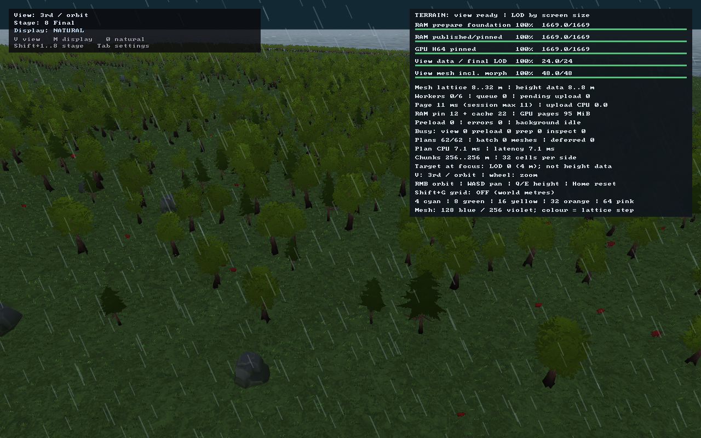
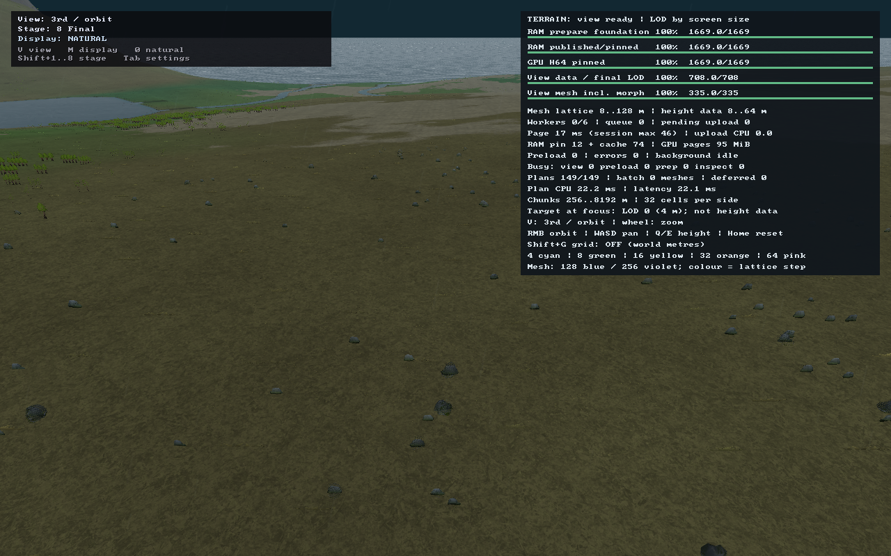
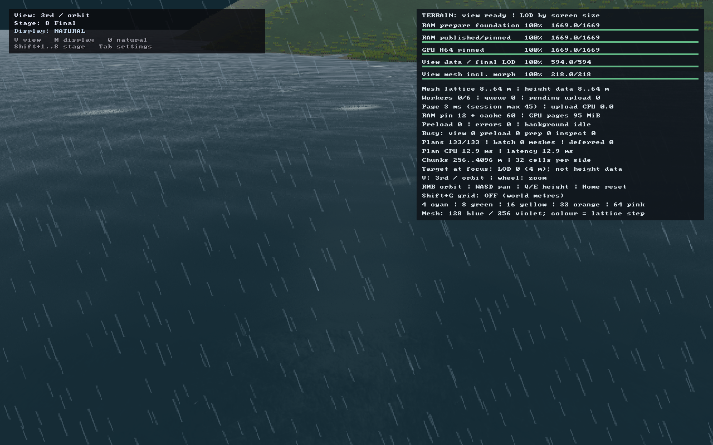

# VG2, первый подшаг — GPU-отсечение и стабильное уплотнение травы

Дата: **2026-09-16**. Продолжение Claude после `b25d034` и `72e67ed`.
Изменения в рабочем дереве, отдельный commit не создавался.
**Это завершённый подшаг травы, не закрытие всего VG2 или этапов генератора.**

## Что подключено к игре

`game::GrassCuller` стал первым runtime-потребителем `engine::ClusterCuller`.
Для adaptive-травы выполняется цепочка:

1. Уже загруженная общая instance-арена читается compute, без второй CPU-копии корней.
2. GPU строит bounding spheres из source/parent/prior/prior-parent высот. Они
   покрывают морфинг поверхности, ширину дальних групп и максимальное качание ветра.
3. `ClusterCuller` удаляет сферы вне кадра и записывает список/indirect count.
4. Mark + двухуровневый prefix-scan восстанавливают **исходный порядок** корней.
5. Gather копирует выжившие 32-байтовые корни в обычный instance vertex buffer.
6. Один indexed indirect draw читает этот буфер. Vertex-storage bindings не нужны.

На непустой кадр — **7 compute dispatch**, на пустой вход — только сброс count.
Рабочие GPU-буферы фиксированы: **9 439 252 байта** (около 9 MiB), без учёта общей
арены и внутренних расходов драйвера. Бюджет входа/выхода — **131 072 корня**.
Буфер CPU-списка кластеров выделяется лениво: GPU-производителю он не нужен.
Позднее разрешение compute-привязки арены выполняется после upload, поэтому рост
арены не оставляет ссылку на старый GPU-буфер. Dispatch выполняется и в кадре без draw,
иначе сброс пустого списка мог бы не произойти.

## Что исправлено перед runtime-подключением

- В перспективе сфера проверяется по настоящим плоскостям **rowW ± rowX/rowY**.
  Прежняя оценка `radius * length(rowX)` теряла компонент глубины боковой плоскости
  и могла отсечь геометрию на краю экрана. Добавлены независимые граничные fixtures,
  ортографическая проверка и инвариант масштабирования матрицы.
- Compute slot **0** является валидным; `ClusterCuller::ready()` больше не считает
  его признаком отсутствующего pipeline.
- Атомарный список отбора не задаёт стабильного порядка. Для травы введён bounded
  scan без предположений о размере GPU subgroup; порядок проверяется напрямую,
  без сортировки результата в тесте.
- После VG1 корень занимает **32**, а не 28 байт. Тест арены всё ещё ожидал
  1 835 008 байт для 65 536 корней; теперь строго проверяет **2 097 152 байта**.
  Guard-page тест сохранён. Валидаторы старых отчётов понимают оба известных
  stride 28/32, но по-прежнему проверяют фактические bytes и выравнивание.

## Контроль изображения: A/B/A, не два независимых запуска

`tools/capture_grass_culling.py` включает `ASR_GRASS_COMPARE_CULL=1` и запускает
11 существующих сценариев. В каждом процессе после готовности сцены снимаются:

- `name.png` — GPU indirect;
- `name.png.direct.png` — тот же мир/камера/время, отключён только culling;
- `name.png.repeat.png` — повторный GPU indirect после восстановления режима.

Декодированы **33 PNG 1280×800**. Во всех **11/11** сценариях и GPU/direct, и
GPU/GPU совпадают попиксельно по RGB: **0 изменённых пикселей**, максимальная
разница канала **0**. Контрольный повтор обязан совпадать побитово; допуск A/B
0,01% не повышался и в финальном прогоне не понадобился. Проверяются также
seed, размеры мира, камера/проекция, viewport, shader time, ветер, популяции,
геометрия моделей, исходные кандидаты и upload bytes.

Первоначальное сравнение отдельных процессов не прошло. Основная часть различий
приходилась на всегда видимую панель статистики с временами/счётчиками фоновой работы;
были и небольшие различия вне панели. Они не объявлены ошибкой culler или допустимым
изменением картинки. Вместо повышения порога введён контролируемый A/B/A одного
процесса. Неудачные прогоны остаются в `build/vg2-{captures,comparison}.log`.

## Что реально сократилось

Числа ниже — **инстансы, поданные в vertex stage**, не число видимых травинок:
материал, вода, coverage, alpha и глубина ещё могут отвергнуть прошедший frustum корень.
`submitted_candidates` сохраняет прежний смысл числа загруженных исходных кандидатов;
`drawn_candidates` и `drawn_triangles` при скриншоте читаются из indirect arguments.
В обычном кадре и в `--trace` синхронного чтения GPU обратно **нет**.

| Кадр | Исходные кандидаты | После GPU frustum | Различия A/B и A/A |
|---|---:|---:|---:|
| [Лес близко](forest-close.png) | 114 688 | 61 719 | 0 / 0 |
| [Лес средне](forest-near.png) | 80 384 | 70 620 | 0 / 0 |
| [Лес далеко](forest-far.png) | 32 217 | 28 502 | 0 / 0 |
| [Широкий план](forest-wide.png) | 19 370 | 18 158 | 0 / 0 |
| [Сдвиг](forest-pan.png) | 32 217 | 29 755 | 0 / 0 |
| [Возврат](forest-return.png) | 32 217 | 28 502 | 0 / 0 |
| [Степь](steppe.png) | 104 602 | 89 232 | 0 / 0 |
| [Долина](valley.png) | 83 711 | 73 567 | 0 / 0 |
| [Берег](coast.png) | 38 640 | 21 083 | 0 / 0 |
| [Свободная камера внизу](forest-free-low.png) | 116 736 | 53 056 | 0 / 0 |
| [Свободная камера наверху](forest-free-high.png) | 22 006 | 1885 | 0 / 0 |
| **Сумма разных контрольных видов** | **676 788** | **476 079** | **0 / 0** |

Суммарно отсеяно **200 709 кандидатов (29,7%)**, в верхнем свободном ракурсе — **91,4%**.
Это не один кадр, не число уникальных растений и **не замер ускорения FPS**.
Draw травы по-прежнему один: его сократил VG1, здесь сокращается число его инстансов.
Модельный бюджет 1 500 000 треугольников, дальние рощи и холодная резидентность сохранены.





## Проверки

- Полный GPU-набор: **31/31**. Из них 6 cluster-cull и 5 grass-cull проверок;
  профильный Debug GPU-набор — **11/11**.
- Offscreen-тест проверяет **нарисованные пиксели**, а не только правильный count.
  Дополнительно: байты и порядок корней, рост арены, полный бюджет выхода,
  сброс без draw, морф-высоты, ветер/ширина групп и отклонение неверных диапазонов.
- Полный terrain: **198/198**. Arena в основной и Debug сборках: **3/3**.
- Полный ring: **77/80**. Сохраняются три известные ошибки:
  `ring_plateau_stream_does_not_load_down_to_sea_level`,
  `ring_water_apron_extends_onto_dry_ground`,
  `water_bodies_river_banks_are_valleys_rather_than_walls`.
  На входе дополнительно падало старое 28-байтовое ожидание арены; оно исправлено.
- Основной и CLion Debug-клиенты собраны. Общий `asr_tests` зелёным не объявляется.
- Художественная приёмка отдельно; статистика и равенство кадров её не заменяют.

## Воспроизведение и продолжение

### Непрерывное движение

Отдельный локальный маршрут `ASR_VEGETATION_TRACE_LOCAL=1` сдвигает камеру на
**384 м внутри контрольного лесного участка**, затем приближает и удерживает её.
Стандартный `--trace` не изменён: его длинная траектория может уйти из леса,
поэтому требовать на ней постоянного наличия рощ некорректно. Два таких пробных
прогона не засчитаны (`build/vg2-motion.log`, `build/vg2-motion-final.log`).

Этот **900-frame** прогон прошёл прежний строгий валидатор: **196 отсчётов**,
первый запрос точной расстановки на кадре **290**, готовность на **350**.
Все 12 отсчётов ожидания 290–345 сохраняли рощи; после начального ожидания пустых
отсчётов нет, минимум рощ — **1260**. Бюджеты и mesh-level accounting соблюдены.
Это проверка непрерывной доступности представлений, не видеоприёмка каждого кадра
и не синхронное чтение GPU-count на каждом отсчёте.
Результат: [motion-checks.json](motion-checks.json), лог `build/vg2-motion-local.log`.

```sh
cmake --build build --target asr_client asr_height_page_gpu_tests asr_terrain_tests asr_ring_tests -j 4
cmake --build cmake-build-debug --target asr_client asr_height_page_gpu_tests asr_ring_tests -j 4
./build/asr_height_page_gpu_tests
./build/asr_terrain_tests
./build/asr_ring_tests
./cmake-build-debug/asr_ring_tests instance_arena
./cmake-build-debug/asr_height_page_gpu_tests cluster_cull grass_cull
.cache/terrain-reference-tools/bin/python tools/capture_grass_culling.py
.cache/terrain-reference-tools/bin/python tools/capture_grass_culling.py --check-only
ASR_VEGETATION_TRACE_LOCAL=1 ASR_VEGETATION_TRACE_SETTLE=1 ./build/asr_client --explore --seed 42 --world 64 --at forest --camera orbit --zoom 0.6 --trace > build/vg2-motion-local.log 2>&1
.cache/terrain-reference-tools/bin/python tools/verify_vegetation_trace.py --log build/vg2-motion-local.log --output doc/reports/vg_step_2/motion-checks.json
```

Данные: [metrics.json](metrics.json), [culling-checks.json](culling-checks.json),
метаданные каждого PNG рядом с ним. Логи итогового сравнения:
`build/vg2-aba-captures.log`; тесты — `build/vg2-{all-gpu,terrain,ring-final,debug-gpu,debug-arena}.log`.

**Оставшаяся VG2:** резидентная расстановка с загрузкой при изменении, GPU LOD
деревьев и детерминированная гистограмма mesh-бюджета, indirect multi-draw деревьев,
затем material/coverage compaction травы. Сейчас CPU всё ещё загружает исходные
корни каждый кадр и обходит точные объекты. Семь compute-проходов и дополнительные
буферы имеют свою стоимость; ускорение требует отдельного сопоставимого замера.
Кластерный DAG, Hi-Z, новый генератор и runtime-пресеты ×4 этим не реализованы.

